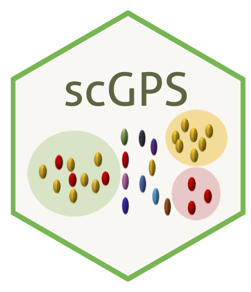

# _scGPS_ - Single Cell Global fate Potential of Subpopulations 

	

The _scGPS_ package website is available at: https://imb-computational-genomics-lab.github.io/scGPS/index.html 

## _scGPS_ general description
A complete  single cell RNA analysis framework to decompose a mixed population into clusters (_SCORE_) and to analyse the relationship between clusters (_scGPS_). _scGPS_ also performs unsupervised selection of predictive genes defining a subpopulation and/or driving transition between subpopulations. 

The package implements two new algorithms _SCORE_ and _scGPS_.

Key features of the _SCORE_ algorithm

- Unsupervised (no prior number of clusters), stable (with bagging), fast (with Rcpp implementation)
- SCORE first built a reference cluster (with the highest resolution) and then run iterative clustering through 40 windows in the dendrogram
- Resolution: divergence from reference (Rand index)
- Stability: number of runs without index changes to the reference
- Optimal resolution is the combination of: stable and high resolution
- Bagging algorithm (bootstrap aggregation) can detect rare subpopulation, which appears multiple times from different decision tree runs 

Key features of the _scGPS_ algorithm

- Estimates transition scores between any two subpopulations
- _scGPS_ prediction model is based on Elastic Net procedure to select predictive genes and train interpretable models
- Genes identified by _scGPS_ perform better than known gene markers in predicting cell subtypes 
- Transition scores are percents of target cells classified as the same class to the original subpopulation 
- For cell subtype comparision, transition scores are similarity between two subpopulations
- The scores are average values from 100 bootstrap runs
- For comparison, a non-shrinkage procedure with linear discriminant analysis (LDA) is used

## _scGPS_ workflow

_scGPS_ takes scRNA expression dataset(s) from one or more unknown sample(s) to find subpopulations and relationship between these subpopulations. The input dataset(s) contains mixed, heterogeous cells. _scGPS_ first uses _SCORE_ (or _CORE_ V2.0) to identify homogenous subpopulations. _scGPS_ contains a number of functions to verify the subpopulations identified by _SCORE_ (e.g. functions to compare with results from PCA, tSNE and the imputation method CIDR). _scGPS_ also has options to find gene markers that distinguish a subpopulation from the remaining cells and performs pathway enrichment analysis to annotate subpopulation. In the second stage, _scGPS_ applies a machine learning procedure to select optimal gene predictors and to build prediction models that can estimate between-subpopulation transition scores, which are the probability of cells from one subpopulation that can likely transition to the other subpopulation.

	  
Figure 1. scGPS workflow. Yellow boxes show inputs, and green boxes show main scGPS analysis.  

