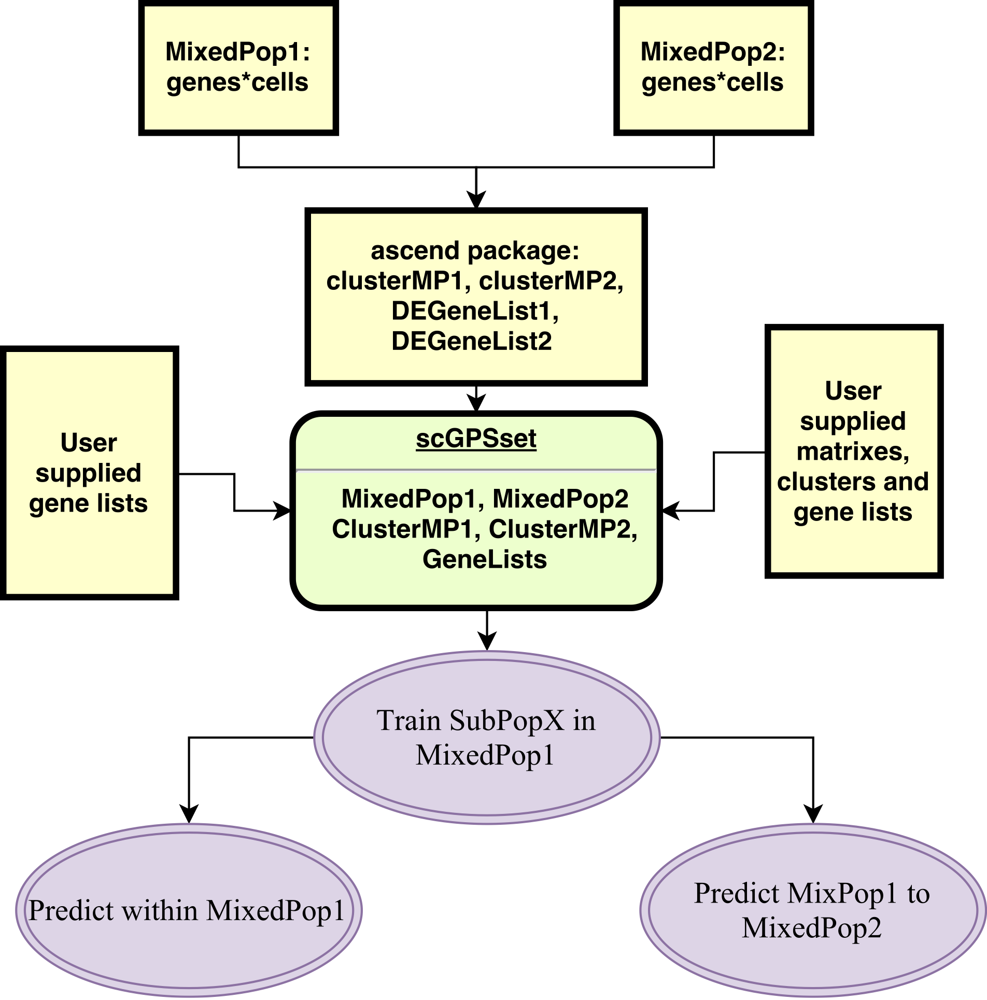

# scGPS general description
A complete  single cell RNA analysis framework to answer the common question: how to decompose a mixed population into clusters (CORE) and to analyse the relationship between clusters (scGPS). 

## scGPS workflow

scGPS takes scRNA expression dataset(s) for one more more unknown sample(s) to find subpopulations and relationship between these subpopulations. The input dataset(s) contains mixed, heterogeous cells. scGPS first uses CORE (V2.0) to identify homogenous subpopulations. scGPS contains a number of functions to verify the subpopulations identified by CORE (e.g. functions to compare with results from PCA, tSNE and the imputation method CIDR). scGPS also has options to find gene markers that distinguish a subpopulation from the remaining cells. In the second stage, scGPS applies a machine learning procedure to select optimal gene predictors and to build prediction models that can estimate between-subpopulation transition scores, which are the probability of cells from one subpopulation that can likely transition to the other subpopulation.

 

  
Figure. scGPS workflow. Yellow boxes show inputs, and green boxes show scGPS analysis functions.  

