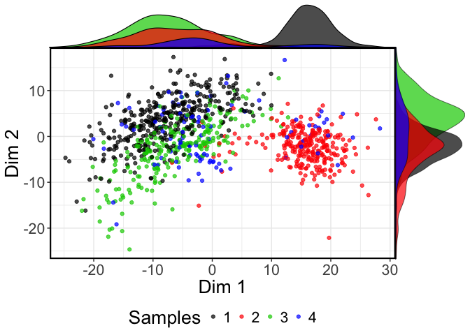

################################################################################
##Installation instruction
################################################################################


```r

#Prior to install scGPS you need to install the SummarizedExperiment bioconductor package as the following
#source("https://bioconductor.org/biocLite.R")
#biocLite("SummarizedExperiment")

#R/3.4.1 or above is required 

#To install from github (Depending on the configuration of the local computer or HPC, possible custom C++ compilation may be required - see installation trouble-shootings below) 
devtools::install_github("IMB-Computational-Genomics-Lab/scGPS")

#for C++ compilation trouble-shooting, manual download and install can be done from github
git clone https://github.com/IMB-Computational-Genomics-Lab/scGPS

#then check in scGPS/src if any of the precompiled (e.g. those with *.so and *.o) files exist and delete them before recompiling

#create a Makevars file in the  scGPS/src with one line: PKG_LIBS = $(LAPACK_LIBS) $(BLAS_LIBS) $(FLIBS)

#then with the scGPS as the R working directory manually compile in R, using devtools
devools::document() 

#and then you can load the package: 
devtools::load_all()

```
##A simple workflow of the scGPS: given a mixed population with known subpopulations, estimate transition scores between these subpopulation 


```r
devtools::load_all()

#load mixed population 1 (loaded from sample1 dataset, named it as day2)
day2 <- sample1
mixedpop1 <-NewscGPS_SME(ExpressionMatrix = day2$dat2_counts, GeneMetadata = day2$dat2geneInfo,
                     CellMetadata = day2$dat2_clusters)
#load mixed population 2 (loaded from sample2 dataset, named it as day5)
day5 <- sample2
mixedpop2 <-NewscGPS_SME(ExpressionMatrix = day5$dat5_counts, GeneMetadata = day5$dat5geneInfo,
                     CellMetadata = day5$dat5_clusters)
#load gene list (this can be any lists of user selected genes)
genes <-GeneList
genes <-genes$Merged_unique

#select a subpopulation
c_selectID <- 1

#run the test bootstrap
suppressWarnings(LSOLDA_dat <- bootstrap_scGPS(nboots = 2,mixedpop1 = mixedpop1, mixedpop2 = mixedpop2, genes=genes, c_selectID, listData =list()))
#> 
#> Call:  glmnet(x = t(predictor_S1), y = y_cat, family = "binomial") 
#> 
#>        Df       %Dev    Lambda
#>   [1,]  0 -2.563e-15 2.768e-01
#>   [2,]  1  3.779e-02 2.522e-01
#>   [3,]  1  7.040e-02 2.298e-01
#>   [4,]  1  9.936e-02 2.094e-01
#>   [5,]  2  1.256e-01 1.908e-01
#>   [6,]  2  1.573e-01 1.738e-01
#>   [7,]  4  1.878e-01 1.584e-01
#>   [8,]  5  2.216e-01 1.443e-01
#>   [9,]  5  2.518e-01 1.315e-01
#>  [10,]  5  2.787e-01 1.198e-01
#>  [11,]  7  3.049e-01 1.092e-01
#>  [12,]  8  3.313e-01 9.948e-02
#>  [13,]  8  3.552e-01 9.064e-02
#>  [14,]  8  3.766e-01 8.259e-02
#>  [15,]  8  3.958e-01 7.525e-02
#>  [16,]  8  4.131e-01 6.857e-02
#>  [17,]  8  4.286e-01 6.247e-02
#>  [18,]  9  4.426e-01 5.692e-02
#>  [19,]  9  4.556e-01 5.187e-02
#>  [20,] 15  4.726e-01 4.726e-02
#>  [21,] 21  4.951e-01 4.306e-02
#>  [22,] 22  5.197e-01 3.924e-02
#>  [23,] 22  5.418e-01 3.575e-02
#>  [24,] 24  5.618e-01 3.257e-02
#>  [25,] 24  5.800e-01 2.968e-02
#>  [26,] 27  5.969e-01 2.704e-02
#>  [27,] 27  6.125e-01 2.464e-02
#>  [28,] 31  6.278e-01 2.245e-02
#>  [29,] 32  6.431e-01 2.046e-02
#>  [30,] 34  6.579e-01 1.864e-02
#>  [31,] 38  6.724e-01 1.698e-02
#>  [32,] 40  6.865e-01 1.548e-02
#>  [33,] 41  6.998e-01 1.410e-02
#>  [34,] 44  7.125e-01 1.285e-02
#>  [35,] 48  7.250e-01 1.171e-02
#>  [36,] 49  7.369e-01 1.067e-02
#>  [37,] 51  7.485e-01 9.719e-03
#>  [38,] 52  7.597e-01 8.856e-03
#>  [39,] 54  7.709e-01 8.069e-03
#>  [40,] 58  7.820e-01 7.352e-03
#>  [41,] 59  7.931e-01 6.699e-03
#>  [42,] 59  8.040e-01 6.104e-03
#>  [43,] 62  8.147e-01 5.562e-03
#>  [44,] 63  8.253e-01 5.068e-03
#>  [45,] 64  8.355e-01 4.617e-03
#>  [46,] 64  8.452e-01 4.207e-03
#>  [47,] 64  8.542e-01 3.833e-03
#>  [48,] 65  8.627e-01 3.493e-03
#>  [49,] 66  8.708e-01 3.183e-03
#>  [50,] 68  8.785e-01 2.900e-03
#>  [51,] 67  8.858e-01 2.642e-03
#>  [52,] 66  8.926e-01 2.407e-03
#>  [53,] 66  8.990e-01 2.194e-03
#>  [54,] 66  9.051e-01 1.999e-03
#>  [55,] 67  9.111e-01 1.821e-03
#>  [56,] 67  9.170e-01 1.659e-03
#>  [57,] 69  9.229e-01 1.512e-03
#>  [58,] 71  9.291e-01 1.378e-03
#>  [59,] 71  9.352e-01 1.255e-03
#>  [60,] 68  9.408e-01 1.144e-03
#>  [61,] 68  9.458e-01 1.042e-03
#>  [62,] 70  9.504e-01 9.496e-04
#>  [63,] 70  9.547e-01 8.652e-04
#>  [64,] 69  9.586e-01 7.883e-04
#>  [65,] 68  9.621e-01 7.183e-04
#>  [66,] 68  9.654e-01 6.545e-04
#>  [67,] 69  9.684e-01 5.964e-04
#>  [68,] 69  9.712e-01 5.434e-04
#>  [69,] 69  9.737e-01 4.951e-04
#>  [70,] 71  9.761e-01 4.511e-04
#>  [71,] 72  9.782e-01 4.110e-04
#>  [72,] 73  9.801e-01 3.745e-04
#>  [73,] 72  9.818e-01 3.413e-04
#>  [74,] 72  9.835e-01 3.109e-04
#>  [75,] 72  9.849e-01 2.833e-04
#>  [76,] 71  9.863e-01 2.581e-04
#>  [77,] 72  9.875e-01 2.352e-04
#>  [78,] 73  9.886e-01 2.143e-04
#>  [79,] 72  9.896e-01 1.953e-04
#>  [80,] 72  9.905e-01 1.779e-04
#>  [81,] 72  9.914e-01 1.621e-04
#>  [82,] 72  9.921e-01 1.477e-04
#>  [83,] 72  9.928e-01 1.346e-04
#>  [84,] 72  9.935e-01 1.226e-04
#>  [85,] 72  9.940e-01 1.117e-04
#>  [86,] 72  9.946e-01 1.018e-04
#>  [87,] 72  9.950e-01 9.277e-05
#>  [88,] 72  9.955e-01 8.453e-05
#>  [89,] 72  9.959e-01 7.702e-05
#>  [90,] 72  9.962e-01 7.018e-05
#>  [91,] 72  9.966e-01 6.394e-05
#>  [92,] 72  9.969e-01 5.826e-05
#>  [93,] 72  9.971e-01 5.309e-05
#>  [94,] 71  9.974e-01 4.837e-05
#>  [95,] 71  9.976e-01 4.407e-05
#>  [96,] 71  9.978e-01 4.016e-05
#>  [97,] 71  9.980e-01 3.659e-05
#>  [98,] 71  9.982e-01 3.334e-05
#>  [99,] 71  9.984e-01 3.038e-05
#> [100,] 71  9.985e-01 2.768e-05
#> [1] "done 1"
#> 
#> Call:  glmnet(x = t(predictor_S1), y = y_cat, family = "binomial") 
#> 
#>        Df       %Dev    Lambda
#>   [1,]  0 -2.563e-15 2.731e-01
#>   [2,]  1  3.680e-02 2.488e-01
#>   [3,]  1  6.859e-02 2.267e-01
#>   [4,]  1  9.679e-02 2.066e-01
#>   [5,]  2  1.279e-01 1.882e-01
#>   [6,]  4  1.607e-01 1.715e-01
#>   [7,]  4  1.957e-01 1.563e-01
#>   [8,]  4  2.262e-01 1.424e-01
#>   [9,]  5  2.539e-01 1.298e-01
#>  [10,]  5  2.801e-01 1.182e-01
#>  [11,]  7  3.038e-01 1.077e-01
#>  [12,]  7  3.268e-01 9.815e-02
#>  [13,]  8  3.473e-01 8.943e-02
#>  [14,]  8  3.663e-01 8.149e-02
#>  [15,]  9  3.838e-01 7.425e-02
#>  [16,]  9  4.005e-01 6.765e-02
#>  [17,] 13  4.185e-01 6.164e-02
#>  [18,] 14  4.391e-01 5.617e-02
#>  [19,] 16  4.580e-01 5.118e-02
#>  [20,] 18  4.766e-01 4.663e-02
#>  [21,] 18  4.940e-01 4.249e-02
#>  [22,] 20  5.103e-01 3.871e-02
#>  [23,] 21  5.270e-01 3.527e-02
#>  [24,] 25  5.460e-01 3.214e-02
#>  [25,] 26  5.644e-01 2.928e-02
#>  [26,] 27  5.812e-01 2.668e-02
#>  [27,] 29  5.967e-01 2.431e-02
#>  [28,] 31  6.119e-01 2.215e-02
#>  [29,] 33  6.266e-01 2.018e-02
#>  [30,] 35  6.409e-01 1.839e-02
#>  [31,] 36  6.545e-01 1.676e-02
#>  [32,] 39  6.675e-01 1.527e-02
#>  [33,] 40  6.798e-01 1.391e-02
#>  [34,] 42  6.914e-01 1.268e-02
#>  [35,] 43  7.025e-01 1.155e-02
#>  [36,] 43  7.130e-01 1.052e-02
#>  [37,] 46  7.231e-01 9.589e-03
#>  [38,] 46  7.332e-01 8.738e-03
#>  [39,] 48  7.429e-01 7.961e-03
#>  [40,] 53  7.528e-01 7.254e-03
#>  [41,] 54  7.625e-01 6.610e-03
#>  [42,] 54  7.718e-01 6.022e-03
#>  [43,] 60  7.809e-01 5.487e-03
#>  [44,] 62  7.907e-01 5.000e-03
#>  [45,] 63  8.009e-01 4.556e-03
#>  [46,] 64  8.111e-01 4.151e-03
#>  [47,] 63  8.206e-01 3.782e-03
#>  [48,] 64  8.298e-01 3.446e-03
#>  [49,] 66  8.390e-01 3.140e-03
#>  [50,] 67  8.484e-01 2.861e-03
#>  [51,] 67  8.574e-01 2.607e-03
#>  [52,] 68  8.661e-01 2.375e-03
#>  [53,] 70  8.745e-01 2.164e-03
#>  [54,] 69  8.826e-01 1.972e-03
#>  [55,] 71  8.904e-01 1.797e-03
#>  [56,] 71  8.980e-01 1.637e-03
#>  [57,] 71  9.053e-01 1.492e-03
#>  [58,] 71  9.127e-01 1.359e-03
#>  [59,] 71  9.200e-01 1.239e-03
#>  [60,] 71  9.270e-01 1.129e-03
#>  [61,] 71  9.335e-01 1.028e-03
#>  [62,] 72  9.396e-01 9.369e-04
#>  [63,] 72  9.451e-01 8.537e-04
#>  [64,] 71  9.501e-01 7.778e-04
#>  [65,] 71  9.547e-01 7.087e-04
#>  [66,] 71  9.588e-01 6.458e-04
#>  [67,] 71  9.626e-01 5.884e-04
#>  [68,] 70  9.660e-01 5.361e-04
#>  [69,] 69  9.691e-01 4.885e-04
#>  [70,] 68  9.719e-01 4.451e-04
#>  [71,] 68  9.744e-01 4.056e-04
#>  [72,] 68  9.767e-01 3.695e-04
#>  [73,] 67  9.788e-01 3.367e-04
#>  [74,] 66  9.807e-01 3.068e-04
#>  [75,] 66  9.824e-01 2.795e-04
#>  [76,] 66  9.839e-01 2.547e-04
#>  [77,] 66  9.854e-01 2.321e-04
#>  [78,] 66  9.867e-01 2.115e-04
#>  [79,] 67  9.879e-01 1.927e-04
#>  [80,] 67  9.890e-01 1.756e-04
#>  [81,] 68  9.899e-01 1.600e-04
#>  [82,] 69  9.908e-01 1.458e-04
#>  [83,] 68  9.916e-01 1.328e-04
#>  [84,] 68  9.924e-01 1.210e-04
#>  [85,] 68  9.931e-01 1.103e-04
#>  [86,] 69  9.937e-01 1.005e-04
#>  [87,] 69  9.942e-01 9.154e-05
#>  [88,] 69  9.948e-01 8.340e-05
#>  [89,] 68  9.952e-01 7.600e-05
#>  [90,] 68  9.956e-01 6.924e-05
#>  [91,] 68  9.960e-01 6.309e-05
#>  [92,] 68  9.964e-01 5.749e-05
#>  [93,] 68  9.967e-01 5.238e-05
#>  [94,] 68  9.970e-01 4.773e-05
#>  [95,] 68  9.972e-01 4.349e-05
#>  [96,] 67  9.975e-01 3.962e-05
#>  [97,] 67  9.977e-01 3.610e-05
#>  [98,] 67  9.979e-01 3.290e-05
#>  [99,] 67  9.981e-01 2.997e-05
#> [100,] 67  9.983e-01 2.731e-05
#> [1] "done 2"

#display some results 
names(LSOLDA_dat)
#> [1] "Accuracy"     "LassoGenes"   "Deviance"     "LassoFit"    
#> [5] "LDAFit"       "predictor_S1" "LassoPredict" "LDAPredict"
LSOLDA_dat$LassoPredict
#> [[1]]
#> [[1]][[1]]
#> [1] "LASSO for subpop2 in target mixedpop2"
#> 
#> [[1]][[2]]
#> [1] 100
#> 
#> [[1]][[3]]
#> [1] "LASSO for subpop3 in target mixedpop2"
#> 
#> [[1]][[4]]
#> [1] 93.49593
#> 
#> [[1]][[5]]
#> [1] "LASSO for subpop1 in target mixedpop2"
#> 
#> [[1]][[6]]
#> [1] 96.44809
#> 
#> [[1]][[7]]
#> [1] "LASSO for subpop4 in target mixedpop2"
#> 
#> [[1]][[8]]
#> [1] 95.91837
#> 
#> 
#> [[2]]
#> [[2]][[1]]
#> [1] "LASSO for subpop2 in target mixedpop2"
#> 
#> [[2]][[2]]
#> [1] 99.2674
#> 
#> [[2]][[3]]
#> [1] "LASSO for subpop3 in target mixedpop2"
#> 
#> [[2]][[4]]
#> [1] 84.14634
#> 
#> [[2]][[5]]
#> [1] "LASSO for subpop1 in target mixedpop2"
#> 
#> [[2]][[6]]
#> [1] 95.35519
#> 
#> [[2]][[7]]
#> [1] "LASSO for subpop4 in target mixedpop2"
#> 
#> [[2]][[8]]
#> [1] 90.81633
LSOLDA_dat$LDAPredict
#> [[1]]
#> [[1]][[1]]
#> [1] "LDA for subpop 2 in target mixedpop2"
#> 
#> [[1]][[2]]
#> [1] 72.89377
#> 
#> [[1]][[3]]
#> [1] "LDA for subpop 3 in target mixedpop2"
#> 
#> [[1]][[4]]
#> [1] 10.1626
#> 
#> [[1]][[5]]
#> [1] "LDA for subpop 1 in target mixedpop2"
#> 
#> [[1]][[6]]
#> [1] 9.289617
#> 
#> [[1]][[7]]
#> [1] "LDA for subpop 4 in target mixedpop2"
#> 
#> [[1]][[8]]
#> [1] 24.4898
#> 
#> 
#> [[2]]
#> [[2]][[1]]
#> [1] "LDA for subpop 2 in target mixedpop2"
#> 
#> [[2]][[2]]
#> [1] 59.70696
#> 
#> [[2]][[3]]
#> [1] "LDA for subpop 3 in target mixedpop2"
#> 
#> [[2]][[4]]
#> [1] 27.23577
#> 
#> [[2]][[5]]
#> [1] "LDA for subpop 1 in target mixedpop2"
#> 
#> [[2]][[6]]
#> [1] 41.53005
#> 
#> [[2]][[7]]
#> [1] "LDA for subpop 4 in target mixedpop2"
#> 
#> [[2]][[8]]
#> [1] 40.81633

#summary results LDA
summary_prediction_lda(LSOLDA_dat=LSOLDA_dat, nPredSubpop = 4)
#>                 V1               V2                                names
#> 1 72.8937728937729 59.7069597069597 LDA for subpop 2 in target mixedpop2
#> 2 10.1626016260163 27.2357723577236 LDA for subpop 3 in target mixedpop2
#> 3  9.2896174863388 41.5300546448087 LDA for subpop 1 in target mixedpop2
#> 4 24.4897959183673 40.8163265306122 LDA for subpop 4 in target mixedpop2

#summary results Lasso
summary_prediction_lasso(LSOLDA_dat=LSOLDA_dat, nPredSubpop = 4)
#>                 V1               V2                                 names
#> 1              100 99.2673992673993 LASSO for subpop2 in target mixedpop2
#> 2 93.4959349593496 84.1463414634146 LASSO for subpop3 in target mixedpop2
#> 3  96.448087431694 95.3551912568306 LASSO for subpop1 in target mixedpop2
#> 4 95.9183673469388 90.8163265306122 LASSO for subpop4 in target mixedpop2

#summary deviance 
summary_deviance(LSOLDA_dat)
#> $allDeviance
#> [1] "0.4426" "0.458" 
#> 
#> $DeviMax
#>          Dfd   Deviance        DEgenes
#> 1          0 -2.563e-15 genes_cluster1
#> 2          1    0.09679 genes_cluster1
#> 3          2     0.1279 genes_cluster1
#> 4          4     0.2262 genes_cluster1
#> 5          5     0.2801 genes_cluster1
#> 6          7     0.3268 genes_cluster1
#> 7          8     0.3663 genes_cluster1
#> 8          9     0.4005 genes_cluster1
#> 9         13     0.4185 genes_cluster1
#> 10        14     0.4391 genes_cluster1
#> 11        16      0.458 genes_cluster1
#> 12 remaining          1        DEgenes
#> 
#> $LassoGenesMax
#>                                   1                   name
#> (Intercept)             0.121512400            (Intercept)
#> CXCR4_ENSG00000121966  -0.115427528  CXCR4_ENSG00000121966
#> FN1_ENSG00000115414    -0.103275644    FN1_ENSG00000115414
#> PDGFRA_ENSG00000134853  0.001520025 PDGFRA_ENSG00000134853
#> FOXC1_ENSG00000054598   0.123168702  FOXC1_ENSG00000054598
#> POU5F1_ENSG00000204531 -0.012393253 POU5F1_ENSG00000204531
#> GJA1_ENSG00000152661   -0.004241154   GJA1_ENSG00000152661
#> T_ENSG00000164458       0.137529058      T_ENSG00000164458
#> SOX17_ENSG00000164736  -0.005314962  SOX17_ENSG00000164736
#> MESP1_ENSG00000166823   0.081695141  MESP1_ENSG00000166823
#> MESP2_ENSG00000188095   0.235711772  MESP2_ENSG00000188095
#> FOXF1_ENSG00000103241   0.196299126  FOXF1_ENSG00000103241
#> GATA6_ENSG00000141448  -0.033447067  GATA6_ENSG00000141448
#> FOXA2_ENSG00000125798  -0.060745776  FOXA2_ENSG00000125798
#> SNAI1_ENSG00000124216   0.023732335  SNAI1_ENSG00000124216
#> LYL1_ENSG00000104903   -0.115721309   LYL1_ENSG00000104903
#> FOXA3_ENSG00000170608  -0.103132601  FOXA3_ENSG00000170608
```
################################################################################
##A complete workflow of the scGPS: given an unknown mixed population, find clusters and estimate relationship between clusters 
################################################################################


```r
#given a single cell expression matrix, without clustering information 
day5 <- sample2
cellnames <- colnames(day5$dat5_counts)
cluster <-day5$dat5_clusters
cellnames <-data.frame("Cluster"=cluster, "cellBarcodes" = cellnames)

mixedpop2 <-NewscGPS_SME(ExpressionMatrix = day5$dat5_counts, GeneMetadata = day5$dat5geneInfo, CellMetadata = cellnames ) 

#let's find the clusters
CORE_cluster <- CORE_scGPS(mixedpop2, remove_outlier = c(0))
#> [1] "Calculating distance matrix"
#> [1] "Performing hierarchical clustering"
#> [1] "Finding clustering information"
#> [1] "No more outliers detected after 1 filtering round"
#> [1] "writing clustering result for run 1"
#> [1] "writing clustering result for run 2"
#> [1] "writing clustering result for run 3"
#> [1] "writing clustering result for run 4"
#> [1] "writing clustering result for run 5"
#> [1] "writing clustering result for run 6"
#> [1] "writing clustering result for run 7"
#> [1] "writing clustering result for run 8"
#> [1] "writing clustering result for run 9"
#> [1] "writing clustering result for run 10"
#> [1] "writing clustering result for run 11"
#> [1] "writing clustering result for run 12"
#> [1] "writing clustering result for run 13"
#> [1] "writing clustering result for run 14"
#> [1] "writing clustering result for run 15"
#> [1] "writing clustering result for run 16"
#> [1] "writing clustering result for run 17"
#> [1] "writing clustering result for run 18"
#> [1] "writing clustering result for run 19"
#> [1] "writing clustering result for run 20"
#> [1] "writing clustering result for run 21"
#> [1] "writing clustering result for run 22"
#> [1] "writing clustering result for run 23"
#> [1] "writing clustering result for run 24"
#> [1] "writing clustering result for run 25"
#> [1] "writing clustering result for run 26"
#> [1] "writing clustering result for run 27"
#> [1] "writing clustering result for run 28"
#> [1] "writing clustering result for run 29"
#> [1] "writing clustering result for run 30"
#> [1] "writing clustering result for run 31"
#> [1] "writing clustering result for run 32"
#> [1] "writing clustering result for run 33"
#> [1] "writing clustering result for run 34"
#> [1] "writing clustering result for run 35"
#> [1] "writing clustering result for run 36"
#> [1] "writing clustering result for run 37"
#> [1] "writing clustering result for run 38"
#> [1] "writing clustering result for run 39"
#> [1] "writing clustering result for run 40"
#> [1] "Done clustering, moving to stability calculation..."
#> [1] "Done calculating stability..."
#> [1] "Start finding optimal clustering..."
#> [1] "Done finding optimal clustering..."
#let's plot all clusters
plot_CORE(CORE_cluster$tree, CORE_cluster$Cluster)
```

<!-- -->

```r

#let's plot just the optimal clustering result (with colored dendrogram)
optimal_index = which(CORE_cluster$optimalClust$KeyStats$Height == CORE_cluster$optimalClust$OptimalRes)

plot_optimal_CORE(original_tree= CORE_cluster$tree, optimal_cluster = unlist(CORE_cluster$Cluster[optimal_index]), shift = -200)
#> [1] "Ordering and assigning labels..."
#> [1] 2
#> [1] 204 424  NA  NA
#> [1] 3
#> [1] 204 424 536  NA
#> [1] 4
#> [1] 204 424 536 808
#> [1] "Plotting the colored dendrogram now...."
```

<!-- -->

```
#> [1] "Plotting the bar underneath now...."
#> [1] "Users are required to check cluster labels...."

#let's compare with other dimensional reduction methods 
library(cidr)
t <- CIDR_scGPS(expression.matrix=assay(mixedpop2))
#> [1] "building cidr object..."
#> [1] "determine dropout candidates..."
#> [1] "determine the imputation weighting threshold..."
#> [1] "computes the _CIDR_ dissimilarity matrix..."
#> [1] "PCA plot with proportion of variance explained..."
#> [1] "find the number of PC..."
#> [1] "perform clustering..."
p2 <-plotReduced_scGPS(t, color_fac = factor(colData(mixedpop2)[,1]),palletes =1:length(unique(colData(mixedpop2)[,1])))
#may need to turn off the R graphic device dev.off() before plotting the following
p2

#load gene list (this can be any lists of user selected genes)
genes <-GeneList
genes <-genes$Merged_unique

#the gene list can also be generated objectively by differential expression analysis
#if the cluster information is in the mixedpop2 object, run this (if not run the CORE
#as described below) 
DEgenes <- findMarkers_scGPS(expression_matrix=assay(mixedpop2), cluster = mixedpop2@colData$Cluster)
#> [1] "Start estimate dispersions for cluster 2..."
#> [1] "Done estimate dispersions. Start nbinom test for cluster 2..."
#> [1] "Done nbinom test for cluster 2 ..."
#> [1] "Adjust foldchange by subtracting basemean to 1..."
#> [1] "Start estimate dispersions for cluster 3..."
#> [1] "Done estimate dispersions. Start nbinom test for cluster 3..."
#> [1] "Done nbinom test for cluster 3 ..."
#> [1] "Adjust foldchange by subtracting basemean to 1..."
#> [1] "Start estimate dispersions for cluster 1..."
#> [1] "Done estimate dispersions. Start nbinom test for cluster 1..."
#> [1] "Done nbinom test for cluster 1 ..."
#> [1] "Adjust foldchange by subtracting basemean to 1..."
#> [1] "Start estimate dispersions for cluster 4..."
#> [1] "Done estimate dispersions. Start nbinom test for cluster 4..."
#> [1] "Done nbinom test for cluster 4 ..."
#> [1] "Adjust foldchange by subtracting basemean to 1..."
names(DEgenes)
#> [1] "DE_Subpop2vsRemaining" "DE_Subpop3vsRemaining" "DE_Subpop1vsRemaining"
#> [4] "DE_Subpop4vsRemaining"

#users need to check the format of the gene input to make sure they are consistent to 
#the gene names in the expression matrix 

#add the CORE cluster information into the scGPS object 
Optimal_index <- which( CORE_cluster$optimalClust$KeyStats$Height == CORE_cluster$optimalClust$OptimalRes)
mixedpop2@colData$Cluster <- unlist(CORE_cluster$Cluster[[Optimal_index]])

#select a subpopulation
c_selectID <- 1

#run the test bootstrap with nboots = 2 runs

suppressWarnings(LSOLDA_dat <- bootstrap_scGPS(nboots = 2,mixedpop1 = mixedpop2, mixedpop2 = mixedpop2, genes=genes, c_selectID, listData =list()))
#> 
#> Call:  glmnet(x = t(predictor_S1), y = y_cat, family = "binomial") 
#> 
#>         Df       %Dev    Lambda
#>   [1,]   0 -2.883e-15 2.769e-01
#>   [2,]   2  4.727e-02 2.523e-01
#>   [3,]   2  9.294e-02 2.299e-01
#>   [4,]   2  1.324e-01 2.095e-01
#>   [5,]   2  1.670e-01 1.909e-01
#>   [6,]   3  1.983e-01 1.739e-01
#>   [7,]   3  2.266e-01 1.585e-01
#>   [8,]   4  2.520e-01 1.444e-01
#>   [9,]   6  2.773e-01 1.316e-01
#>  [10,]   6  3.002e-01 1.199e-01
#>  [11,]   6  3.203e-01 1.092e-01
#>  [12,]   7  3.384e-01 9.953e-02
#>  [13,]   6  3.549e-01 9.069e-02
#>  [14,]   6  3.692e-01 8.263e-02
#>  [15,]   9  3.832e-01 7.529e-02
#>  [16,]  10  3.970e-01 6.860e-02
#>  [17,]  10  4.094e-01 6.251e-02
#>  [18,]  13  4.221e-01 5.695e-02
#>  [19,]  14  4.352e-01 5.189e-02
#>  [20,]  16  4.473e-01 4.728e-02
#>  [21,]  18  4.595e-01 4.308e-02
#>  [22,]  23  4.728e-01 3.926e-02
#>  [23,]  23  4.869e-01 3.577e-02
#>  [24,]  25  4.998e-01 3.259e-02
#>  [25,]  27  5.121e-01 2.970e-02
#>  [26,]  29  5.239e-01 2.706e-02
#>  [27,]  32  5.374e-01 2.465e-02
#>  [28,]  38  5.521e-01 2.246e-02
#>  [29,]  39  5.658e-01 2.047e-02
#>  [30,]  43  5.789e-01 1.865e-02
#>  [31,]  44  5.920e-01 1.699e-02
#>  [32,]  44  6.039e-01 1.548e-02
#>  [33,]  48  6.144e-01 1.411e-02
#>  [34,]  54  6.245e-01 1.285e-02
#>  [35,]  55  6.349e-01 1.171e-02
#>  [36,]  58  6.446e-01 1.067e-02
#>  [37,]  63  6.535e-01 9.724e-03
#>  [38,]  66  6.630e-01 8.860e-03
#>  [39,]  66  6.720e-01 8.073e-03
#>  [40,]  70  6.804e-01 7.356e-03
#>  [41,]  72  6.881e-01 6.702e-03
#>  [42,]  75  6.954e-01 6.107e-03
#>  [43,]  79  7.043e-01 5.564e-03
#>  [44,]  86  7.132e-01 5.070e-03
#>  [45,]  87  7.221e-01 4.620e-03
#>  [46,]  89  7.306e-01 4.209e-03
#>  [47,]  87  7.389e-01 3.835e-03
#>  [48,]  88  7.468e-01 3.495e-03
#>  [49,]  91  7.547e-01 3.184e-03
#>  [50,]  89  7.626e-01 2.901e-03
#>  [51,]  89  7.702e-01 2.644e-03
#>  [52,]  89  7.774e-01 2.409e-03
#>  [53,]  88  7.840e-01 2.195e-03
#>  [54,]  89  7.904e-01 2.000e-03
#>  [55,]  92  7.967e-01 1.822e-03
#>  [56,]  94  8.028e-01 1.660e-03
#>  [57,]  94  8.086e-01 1.513e-03
#>  [58,]  94  8.140e-01 1.378e-03
#>  [59,]  93  8.195e-01 1.256e-03
#>  [60,]  96  8.245e-01 1.144e-03
#>  [61,]  99  8.297e-01 1.043e-03
#>  [62,]  98  8.345e-01 9.500e-04
#>  [63,]  97  8.390e-01 8.656e-04
#>  [64,] 100  8.432e-01 7.887e-04
#>  [65,] 103  8.474e-01 7.187e-04
#>  [66,] 103  8.514e-01 6.548e-04
#>  [67,] 106  8.552e-01 5.967e-04
#>  [68,] 106  8.592e-01 5.437e-04
#>  [69,] 106  8.630e-01 4.954e-04
#>  [70,] 107  8.667e-01 4.513e-04
#>  [71,] 107  8.705e-01 4.113e-04
#>  [72,] 107  8.744e-01 3.747e-04
#>  [73,] 105  8.783e-01 3.414e-04
#>  [74,] 105  8.820e-01 3.111e-04
#>  [75,] 104  8.856e-01 2.835e-04
#>  [76,] 106  8.890e-01 2.583e-04
#>  [77,] 105  8.922e-01 2.353e-04
#>  [78,] 106  8.951e-01 2.144e-04
#>  [79,] 106  8.979e-01 1.954e-04
#>  [80,] 108  9.006e-01 1.780e-04
#>  [81,] 108  9.033e-01 1.622e-04
#>  [82,] 107  9.060e-01 1.478e-04
#>  [83,] 106  9.084e-01 1.347e-04
#>  [84,] 106  9.108e-01 1.227e-04
#>  [85,] 106  9.133e-01 1.118e-04
#>  [86,] 107  9.161e-01 1.019e-04
#>  [87,] 106  9.191e-01 9.282e-05
#>  [88,] 106  9.226e-01 8.457e-05
#>  [89,] 106  9.261e-01 7.706e-05
#>  [90,] 107  9.301e-01 7.022e-05
#>  [91,] 107  9.336e-01 6.398e-05
#>  [92,] 108  9.379e-01 5.829e-05
#>  [93,] 107  9.429e-01 5.312e-05
#>  [94,] 107  9.476e-01 4.840e-05
#>  [95,] 106  9.523e-01 4.410e-05
#>  [96,] 105  9.568e-01 4.018e-05
#>  [97,] 105  9.607e-01 3.661e-05
#>  [98,] 105  9.644e-01 3.336e-05
#>  [99,] 104  9.679e-01 3.039e-05
#> [100,] 105  9.709e-01 2.769e-05
#> [1] "done 1"
#> 
#> Call:  glmnet(x = t(predictor_S1), y = y_cat, family = "binomial") 
#> 
#>         Df       %Dev    Lambda
#>   [1,]   0 -2.883e-15 2.626e-01
#>   [2,]   3  3.649e-02 2.393e-01
#>   [3,]   3  7.973e-02 2.180e-01
#>   [4,]   3  1.168e-01 1.987e-01
#>   [5,]   3  1.491e-01 1.810e-01
#>   [6,]   3  1.774e-01 1.649e-01
#>   [7,]   4  2.025e-01 1.503e-01
#>   [8,]   4  2.264e-01 1.369e-01
#>   [9,]   6  2.477e-01 1.248e-01
#>  [10,]   6  2.672e-01 1.137e-01
#>  [11,]   7  2.851e-01 1.036e-01
#>  [12,]   7  3.010e-01 9.439e-02
#>  [13,]   7  3.150e-01 8.600e-02
#>  [14,]   9  3.286e-01 7.836e-02
#>  [15,]   9  3.424e-01 7.140e-02
#>  [16,]  10  3.545e-01 6.506e-02
#>  [17,]  13  3.689e-01 5.928e-02
#>  [18,]  14  3.827e-01 5.401e-02
#>  [19,]  15  3.965e-01 4.921e-02
#>  [20,]  16  4.088e-01 4.484e-02
#>  [21,]  16  4.202e-01 4.086e-02
#>  [22,]  18  4.315e-01 3.723e-02
#>  [23,]  23  4.454e-01 3.392e-02
#>  [24,]  27  4.596e-01 3.091e-02
#>  [25,]  30  4.730e-01 2.816e-02
#>  [26,]  34  4.857e-01 2.566e-02
#>  [27,]  36  4.982e-01 2.338e-02
#>  [28,]  39  5.105e-01 2.130e-02
#>  [29,]  42  5.227e-01 1.941e-02
#>  [30,]  48  5.352e-01 1.769e-02
#>  [31,]  52  5.471e-01 1.612e-02
#>  [32,]  54  5.583e-01 1.468e-02
#>  [33,]  57  5.694e-01 1.338e-02
#>  [34,]  60  5.798e-01 1.219e-02
#>  [35,]  61  5.900e-01 1.111e-02
#>  [36,]  62  5.999e-01 1.012e-02
#>  [37,]  63  6.090e-01 9.222e-03
#>  [38,]  62  6.173e-01 8.402e-03
#>  [39,]  64  6.249e-01 7.656e-03
#>  [40,]  70  6.326e-01 6.976e-03
#>  [41,]  71  6.407e-01 6.356e-03
#>  [42,]  70  6.483e-01 5.791e-03
#>  [43,]  72  6.550e-01 5.277e-03
#>  [44,]  75  6.615e-01 4.808e-03
#>  [45,]  79  6.682e-01 4.381e-03
#>  [46,]  81  6.748e-01 3.992e-03
#>  [47,]  84  6.811e-01 3.637e-03
#>  [48,]  86  6.872e-01 3.314e-03
#>  [49,]  91  6.931e-01 3.020e-03
#>  [50,]  94  6.992e-01 2.751e-03
#>  [51,]  96  7.049e-01 2.507e-03
#>  [52,]  98  7.104e-01 2.284e-03
#>  [53,]  98  7.156e-01 2.081e-03
#>  [54,]  99  7.203e-01 1.896e-03
#>  [55,] 100  7.247e-01 1.728e-03
#>  [56,] 101  7.288e-01 1.574e-03
#>  [57,] 101  7.326e-01 1.435e-03
#>  [58,] 102  7.361e-01 1.307e-03
#>  [59,] 102  7.394e-01 1.191e-03
#>  [60,] 105  7.425e-01 1.085e-03
#>  [61,] 105  7.454e-01 9.888e-04
#>  [62,] 107  7.482e-01 9.010e-04
#>  [63,] 107  7.509e-01 8.209e-04
#>  [64,] 107  7.535e-01 7.480e-04
#>  [65,] 109  7.562e-01 6.816e-04
#>  [66,] 108  7.588e-01 6.210e-04
#>  [67,] 107  7.612e-01 5.658e-04
#>  [68,] 107  7.636e-01 5.156e-04
#>  [69,] 107  7.658e-01 4.698e-04
#>  [70,] 105  7.679e-01 4.280e-04
#>  [71,] 104  7.699e-01 3.900e-04
#>  [72,] 104  7.717e-01 3.554e-04
#>  [73,] 105  7.735e-01 3.238e-04
#>  [74,] 106  7.753e-01 2.950e-04
#>  [75,] 107  7.770e-01 2.688e-04
#>  [76,] 107  7.787e-01 2.449e-04
#>  [77,] 108  7.804e-01 2.232e-04
#>  [78,] 109  7.821e-01 2.034e-04
#>  [79,] 109  7.838e-01 1.853e-04
#>  [80,] 112  7.855e-01 1.688e-04
#>  [81,] 111  7.870e-01 1.538e-04
#>  [82,] 112  7.884e-01 1.402e-04
#>  [83,] 113  7.897e-01 1.277e-04
#>  [84,] 113  7.910e-01 1.164e-04
#>  [85,] 113  7.922e-01 1.060e-04
#>  [86,] 113  7.932e-01 9.661e-05
#>  [87,] 114  7.940e-01 8.803e-05
#>  [88,] 114  7.948e-01 8.021e-05
#>  [89,] 115  7.955e-01 7.308e-05
#>  [90,] 115  7.962e-01 6.659e-05
#>  [91,] 115  7.967e-01 6.067e-05
#>  [92,] 114  7.972e-01 5.528e-05
#>  [93,] 114  7.976e-01 5.037e-05
#>  [94,] 115  7.980e-01 4.590e-05
#>  [95,] 115  7.983e-01 4.182e-05
#>  [96,] 115  7.986e-01 3.810e-05
#>  [97,] 115  7.988e-01 3.472e-05
#>  [98,] 115  7.990e-01 3.163e-05
#>  [99,] 115  7.992e-01 2.882e-05
#> [100,] 115  7.994e-01 2.626e-05
#> [1] "done 2"

#display summary results 
#summary results LDA
row_cluster <-length(unique(mixedpop2@colData$Cluster))
summary_prediction_lda(LSOLDA_dat=LSOLDA_dat, nPredSubpop = row_cluster )
#>                 V1               V2                                names
#> 1 79.9019607843137 83.3333333333333 LDA for subpop 1 in target mixedpop2
#> 2 12.8571428571429 19.1428571428571 LDA for subpop 2 in target mixedpop2
#> 3 13.4715025906736 16.0621761658031 LDA for subpop 3 in target mixedpop2
#> 4            18.75           21.875 LDA for subpop 4 in target mixedpop2

#summary results Lasso
summary_prediction_lasso(LSOLDA_dat=LSOLDA_dat, nPredSubpop = row_cluster)
#>                 V1               V2                                 names
#> 1 81.6176470588235 84.3137254901961 LASSO for subpop1 in target mixedpop2
#> 2               12 16.2857142857143 LASSO for subpop2 in target mixedpop2
#> 3 11.3989637305699 11.3989637305699 LASSO for subpop3 in target mixedpop2
#> 4               25            31.25 LASSO for subpop4 in target mixedpop2

#summary deviance 
summary_deviance(LSOLDA_dat)
#> $allDeviance
#> [1] "0.592"  "0.5471"
#> 
#> $DeviMax
#>          Dfd   Deviance        DEgenes
#> 1          0 -2.883e-15 genes_cluster1
#> 2          2      0.167 genes_cluster1
#> 3          3     0.2266 genes_cluster1
#> 4          4      0.252 genes_cluster1
#> 5          6     0.3692 genes_cluster1
#> 6          7     0.3384 genes_cluster1
#> 7          9     0.3832 genes_cluster1
#> 8         10     0.4094 genes_cluster1
#> 9         13     0.4221 genes_cluster1
#> 10        14     0.4352 genes_cluster1
#> 11        16     0.4473 genes_cluster1
#> 12        18     0.4595 genes_cluster1
#> 13        23     0.4869 genes_cluster1
#> 14        25     0.4998 genes_cluster1
#> 15        27     0.5121 genes_cluster1
#> 16        29     0.5239 genes_cluster1
#> 17        32     0.5374 genes_cluster1
#> 18        38     0.5521 genes_cluster1
#> 19        39     0.5658 genes_cluster1
#> 20        43     0.5789 genes_cluster1
#> 21        44      0.592 genes_cluster1
#> 22 remaining          1        DEgenes
#> 
#> $LassoGenesMax
#>                                     1                    name
#> (Intercept)             -1.612503e+00             (Intercept)
#> FABP3_ENSG00000121769    5.716368e-02   FABP3_ENSG00000121769
#> TAL1_ENSG00000162367     5.438674e-01    TAL1_ENSG00000162367
#> OLFM3_ENSG00000118733    8.325400e-01   OLFM3_ENSG00000118733
#> TPM3_ENSG00000143549    -1.534037e-01    TPM3_ENSG00000143549
#> DDR2_ENSG00000162733     3.173659e-01    DDR2_ENSG00000162733
#> TNNI1_ENSG00000159173    4.862239e-02   TNNI1_ENSG00000159173
#> CXCR4_ENSG00000121966   -1.171175e-01   CXCR4_ENSG00000121966
#> TTN_ENSG00000155657      2.150644e-02     TTN_ENSG00000155657
#> EOMES_ENSG00000163508   -6.405375e-01   EOMES_ENSG00000163508
#> KDR_ENSG00000128052      4.826166e-02     KDR_ENSG00000128052
#> CXCL5_ENSG00000163735   -2.893528e-01   CXCL5_ENSG00000163735
#> HAND2_ENSG00000164107    1.778184e-01   HAND2_ENSG00000164107
#> ISL1_ENSG00000016082     1.267804e-02    ISL1_ENSG00000016082
#> HAND1_ENSG00000113196    6.929525e-02   HAND1_ENSG00000113196
#> NKX2-5_ENSG00000183072  -1.820587e-02  NKX2-5_ENSG00000183072
#> SRF_ENSG00000112658      4.615219e-01     SRF_ENSG00000112658
#> PRDM1_ENSG00000057657   -1.275754e-01   PRDM1_ENSG00000057657
#> TBX20_ENSG00000164532   -1.021648e+00   TBX20_ENSG00000164532
#> MYL7_ENSG00000106631     6.674836e-05    MYL7_ENSG00000106631
#> MEST_ENSG00000106484     4.353405e-02    MEST_ENSG00000106484
#> SMARCD3_ENSG00000082014  1.143963e-01 SMARCD3_ENSG00000082014
#> SNAI2_ENSG00000019549    2.792211e-01   SNAI2_ENSG00000019549
#> SOX17_ENSG00000164736   -1.108042e-01   SOX17_ENSG00000164736
#> HEY1_ENSG00000164683     1.348417e-01    HEY1_ENSG00000164683
#> TPM2_ENSG00000198467     6.516527e-02    TPM2_ENSG00000198467
#> ZBTB16_ENSG00000109906  -2.874675e-01  ZBTB16_ENSG00000109906
#> VIM_ENSG00000026025      1.954265e-02     VIM_ENSG00000026025
#> NODAL_ENSG00000156574    1.032616e-01   NODAL_ENSG00000156574
#> HHEX_ENSG00000152804    -1.428381e-01    HHEX_ENSG00000152804
#> GDF3_ENSG00000184344     5.329762e-01    GDF3_ENSG00000184344
#> COL2A1_ENSG00000139219   7.801226e-03  COL2A1_ENSG00000139219
#> TBX5_ENSG00000089225    -5.476070e-01    TBX5_ENSG00000089225
#> CDX2_ENSG00000165556    -4.301606e-01    CDX2_ENSG00000165556
#> GSC_ENSG00000133937      5.144655e-02     GSC_ENSG00000133937
#> ACTC1_ENSG00000159251    3.391699e-03   ACTC1_ENSG00000159251
#> MESP1_ENSG00000166823    1.291137e-01   MESP1_ENSG00000166823
#> NR2F2_ENSG00000185551    4.288881e-01   NR2F2_ENSG00000185551
#> CDH5_ENSG00000179776    -1.589602e-01    CDH5_ENSG00000179776
#> FOXF1_ENSG00000103241   -1.196718e+00   FOXF1_ENSG00000103241
#> HNF1B_ENSG00000275410   -6.968092e-02   HNF1B_ENSG00000275410
#> MYL4_ENSG00000198336     3.959003e-02    MYL4_ENSG00000198336
#> GATA5_ENSG00000130700    9.500587e-02   GATA5_ENSG00000130700
#> FOXA3_ENSG00000170608   -3.945554e-01   FOXA3_ENSG00000170608
#> TNNI3_ENSG00000129991   -2.499901e-01   TNNI3_ENSG00000129991
```

<!-- -->
