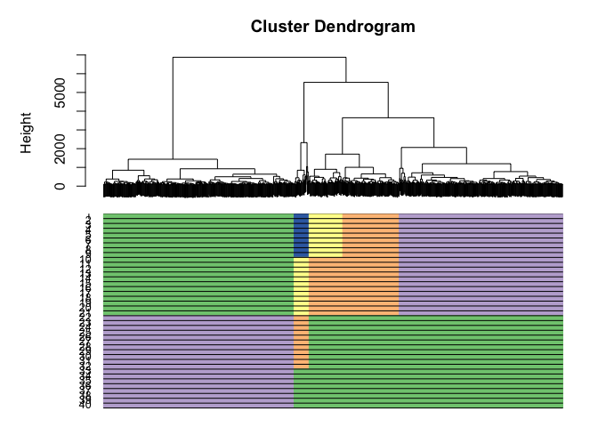
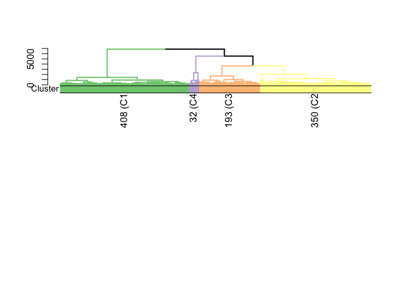
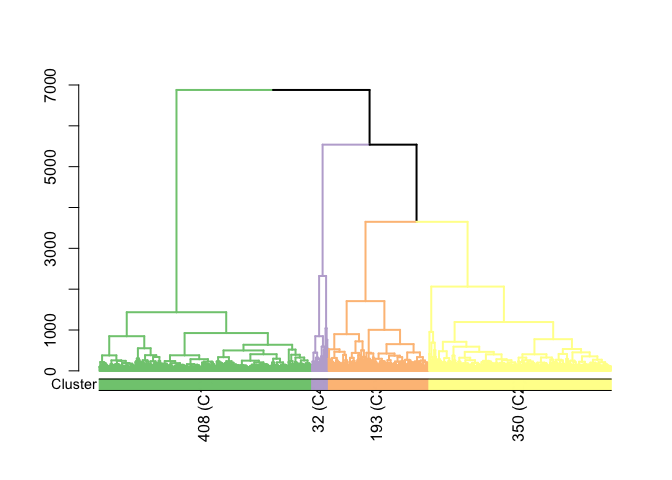
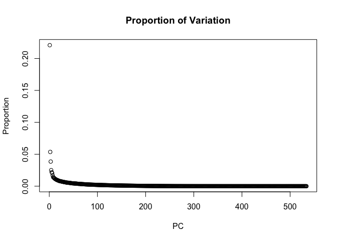
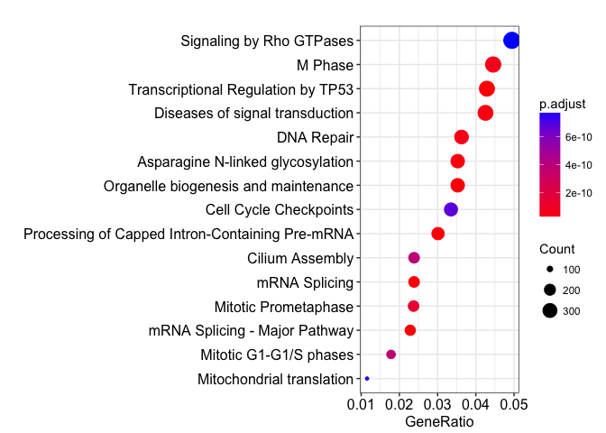

#Installation instruction


```r
# Prior to installing scGPS you need to install the SummarizedExperiment
# bioconductor package as the following
# source('https://bioconductor.org/biocLite.R') biocLite('SummarizedExperiment')

# R/3.4.1 or above is required

# To install scGPS from github (Depending on the configuration of the local
# computer or HPC, possible custom C++ compilation may be required - see
# installation trouble-shootings below)
devtools::install_github("IMB-Computational-Genomics-Lab/scGPS")

# for C++ compilation trouble-shooting, manual download and installation can be
# done from github

# git clone https://github.com/IMB-Computational-Genomics-Lab/scGPS

# then check in scGPS/src if any of the precompiled (e.g.  those with *.so and
# *.o) files exist and delete them before recompiling

# create a Makevars file in the scGPS/src with one line: PKG_LIBS =
# $(LAPACK_LIBS) $(BLAS_LIBS) $(FLIBS)

# then with the scGPS as the R working directory, manually recompile scGPS in R
# using devtools to load and install functions
devtools::document()
# update the NAMESPACE using the update_NAMESPACE.sh 
sh update_NAMESPACE.sh 
#for window system, to update the NAMESPACE: copy and paste the content of the file NAMESPACE_toAdd_cpp_links to end of the file NAMESPACE 

```

#A simple workflow of the scGPS: 
##*Given a mixed population with known subpopulations, estimate transition scores between these subpopulation*


```r
devtools::load_all()

# load mixed population 1 (loaded from sample1 dataset, named it as day2)
day2 <- sample1

mixedpop1 <- NewscGPS_SME(ExpressionMatrix = day2$dat2_counts, GeneMetadata = day2$dat2geneInfo, 
    CellMetadata = day2$dat2_clusters)

# load mixed population 2 (loaded from sample2 dataset, named it as day5)
day5 <- sample2
mixedpop2 <- NewscGPS_SME(ExpressionMatrix = day5$dat5_counts, GeneMetadata = day5$dat5geneInfo, 
    CellMetadata = day5$dat5_clusters)

# load gene list (this can be any lists of user selected genes)
genes <- GeneList
genes <- genes$Merged_unique

# select a subpopulation
c_selectID <- 1

# run the test bootstrap
sink("temp")
LSOLDA_dat <- bootstrap_scGPS(nboots = 2, mixedpop1 = mixedpop1, 
    mixedpop2 = mixedpop2, genes = genes, c_selectID, listData = list())
#> 
#> Call:  glmnet(x = t(predictor_S1), y = y_cat, family = "binomial") 
#> 
#>        Df       %Dev    Lambda
#>   [1,]  0 -2.563e-15 2.675e-01
#>   [2,]  1  3.522e-02 2.437e-01
#>   [3,]  2  7.200e-02 2.221e-01
#>   [4,]  2  1.057e-01 2.023e-01
#>   [5,]  2  1.347e-01 1.844e-01
#>   [6,]  2  1.600e-01 1.680e-01
#>   [7,]  2  1.823e-01 1.531e-01
#>   [8,]  2  2.019e-01 1.395e-01
#>   [9,]  4  2.236e-01 1.271e-01
#>  [10,]  6  2.483e-01 1.158e-01
#>  [11,]  8  2.731e-01 1.055e-01
#>  [12,]  8  2.955e-01 9.613e-02
#>  [13,]  9  3.154e-01 8.759e-02
#>  [14,]  9  3.338e-01 7.981e-02
#>  [15,]  9  3.501e-01 7.272e-02
#>  [16,]  9  3.648e-01 6.626e-02
#>  [17,] 10  3.795e-01 6.037e-02
#>  [18,] 13  3.958e-01 5.501e-02
#>  [19,] 14  4.119e-01 5.012e-02
#>  [20,] 17  4.275e-01 4.567e-02
#>  [21,] 19  4.436e-01 4.161e-02
#>  [22,] 20  4.617e-01 3.792e-02
#>  [23,] 25  4.817e-01 3.455e-02
#>  [24,] 30  5.049e-01 3.148e-02
#>  [25,] 34  5.286e-01 2.868e-02
#>  [26,] 35  5.509e-01 2.613e-02
#>  [27,] 38  5.714e-01 2.381e-02
#>  [28,] 42  5.916e-01 2.170e-02
#>  [29,] 44  6.116e-01 1.977e-02
#>  [30,] 44  6.298e-01 1.801e-02
#>  [31,] 47  6.465e-01 1.641e-02
#>  [32,] 48  6.623e-01 1.495e-02
#>  [33,] 51  6.773e-01 1.363e-02
#>  [34,] 52  6.912e-01 1.242e-02
#>  [35,] 53  7.041e-01 1.131e-02
#>  [36,] 54  7.161e-01 1.031e-02
#>  [37,] 55  7.272e-01 9.392e-03
#>  [38,] 57  7.382e-01 8.558e-03
#>  [39,] 58  7.493e-01 7.798e-03
#>  [40,] 60  7.601e-01 7.105e-03
#>  [41,] 61  7.718e-01 6.474e-03
#>  [42,] 62  7.831e-01 5.899e-03
#>  [43,] 62  7.945e-01 5.375e-03
#>  [44,] 63  8.057e-01 4.897e-03
#>  [45,] 66  8.166e-01 4.462e-03
#>  [46,] 68  8.279e-01 4.066e-03
#>  [47,] 69  8.390e-01 3.704e-03
#>  [48,] 70  8.496e-01 3.375e-03
#>  [49,] 70  8.597e-01 3.075e-03
#>  [50,] 71  8.692e-01 2.802e-03
#>  [51,] 71  8.784e-01 2.553e-03
#>  [52,] 72  8.873e-01 2.327e-03
#>  [53,] 73  8.959e-01 2.120e-03
#>  [54,] 71  9.040e-01 1.932e-03
#>  [55,] 70  9.116e-01 1.760e-03
#>  [56,] 71  9.186e-01 1.604e-03
#>  [57,] 71  9.252e-01 1.461e-03
#>  [58,] 70  9.313e-01 1.331e-03
#>  [59,] 70  9.370e-01 1.213e-03
#>  [60,] 71  9.423e-01 1.105e-03
#>  [61,] 72  9.472e-01 1.007e-03
#>  [62,] 73  9.519e-01 9.176e-04
#>  [63,] 73  9.562e-01 8.361e-04
#>  [64,] 73  9.601e-01 7.618e-04
#>  [65,] 72  9.637e-01 6.941e-04
#>  [66,] 70  9.669e-01 6.325e-04
#>  [67,] 70  9.699e-01 5.763e-04
#>  [68,] 70  9.725e-01 5.251e-04
#>  [69,] 70  9.750e-01 4.784e-04
#>  [70,] 70  9.772e-01 4.359e-04
#>  [71,] 70  9.792e-01 3.972e-04
#>  [72,] 71  9.811e-01 3.619e-04
#>  [73,] 71  9.828e-01 3.298e-04
#>  [74,] 71  9.843e-01 3.005e-04
#>  [75,] 71  9.857e-01 2.738e-04
#>  [76,] 71  9.870e-01 2.495e-04
#>  [77,] 71  9.881e-01 2.273e-04
#>  [78,] 71  9.892e-01 2.071e-04
#>  [79,] 71  9.901e-01 1.887e-04
#>  [80,] 72  9.910e-01 1.719e-04
#>  [81,] 72  9.918e-01 1.567e-04
#>  [82,] 72  9.925e-01 1.428e-04
#>  [83,] 72  9.932e-01 1.301e-04
#>  [84,] 73  9.938e-01 1.185e-04
#>  [85,] 73  9.943e-01 1.080e-04
#>  [86,] 73  9.948e-01 9.839e-05
#>  [87,] 73  9.953e-01 8.965e-05
#>  [88,] 73  9.957e-01 8.169e-05
#>  [89,] 73  9.961e-01 7.443e-05
#>  [90,] 73  9.964e-01 6.782e-05
#>  [91,] 74  9.967e-01 6.179e-05
#>  [92,] 74  9.970e-01 5.630e-05
#>  [93,] 74  9.973e-01 5.130e-05
#>  [94,] 74  9.975e-01 4.674e-05
#>  [95,] 75  9.977e-01 4.259e-05
#>  [96,] 74  9.979e-01 3.881e-05
#>  [97,] 74  9.981e-01 3.536e-05
#>  [98,] 74  9.983e-01 3.222e-05
#>  [99,] 74  9.984e-01 2.936e-05
#> [100,] 74  9.986e-01 2.675e-05
#> [1] "done bootstrap 1"
#> 
#> Call:  glmnet(x = t(predictor_S1), y = y_cat, family = "binomial") 
#> 
#>        Df       %Dev    Lambda
#>   [1,]  0 -2.563e-15 2.293e-01
#>   [2,]  2  2.898e-02 2.089e-01
#>   [3,]  2  5.953e-02 1.904e-01
#>   [4,]  4  9.116e-02 1.735e-01
#>   [5,]  5  1.235e-01 1.580e-01
#>   [6,]  5  1.553e-01 1.440e-01
#>   [7,]  6  1.856e-01 1.312e-01
#>   [8,]  8  2.143e-01 1.196e-01
#>   [9,]  9  2.413e-01 1.089e-01
#>  [10,] 10  2.673e-01 9.926e-02
#>  [11,] 11  2.915e-01 9.044e-02
#>  [12,] 11  3.143e-01 8.241e-02
#>  [13,] 12  3.352e-01 7.509e-02
#>  [14,] 13  3.551e-01 6.841e-02
#>  [15,] 15  3.744e-01 6.234e-02
#>  [16,] 17  3.948e-01 5.680e-02
#>  [17,] 18  4.141e-01 5.175e-02
#>  [18,] 19  4.331e-01 4.716e-02
#>  [19,] 20  4.517e-01 4.297e-02
#>  [20,] 21  4.687e-01 3.915e-02
#>  [21,] 20  4.867e-01 3.567e-02
#>  [22,] 22  5.057e-01 3.250e-02
#>  [23,] 22  5.231e-01 2.962e-02
#>  [24,] 27  5.396e-01 2.698e-02
#>  [25,] 31  5.573e-01 2.459e-02
#>  [26,] 32  5.744e-01 2.240e-02
#>  [27,] 34  5.903e-01 2.041e-02
#>  [28,] 38  6.048e-01 1.860e-02
#>  [29,] 41  6.194e-01 1.695e-02
#>  [30,] 45  6.341e-01 1.544e-02
#>  [31,] 46  6.477e-01 1.407e-02
#>  [32,] 46  6.602e-01 1.282e-02
#>  [33,] 47  6.723e-01 1.168e-02
#>  [34,] 49  6.839e-01 1.064e-02
#>  [35,] 53  6.955e-01 9.698e-03
#>  [36,] 54  7.070e-01 8.836e-03
#>  [37,] 57  7.185e-01 8.051e-03
#>  [38,] 58  7.295e-01 7.336e-03
#>  [39,] 59  7.400e-01 6.684e-03
#>  [40,] 59  7.502e-01 6.090e-03
#>  [41,] 61  7.603e-01 5.549e-03
#>  [42,] 61  7.708e-01 5.056e-03
#>  [43,] 62  7.811e-01 4.607e-03
#>  [44,] 63  7.911e-01 4.198e-03
#>  [45,] 64  8.014e-01 3.825e-03
#>  [46,] 66  8.123e-01 3.485e-03
#>  [47,] 68  8.234e-01 3.176e-03
#>  [48,] 67  8.347e-01 2.893e-03
#>  [49,] 66  8.455e-01 2.636e-03
#>  [50,] 66  8.558e-01 2.402e-03
#>  [51,] 68  8.657e-01 2.189e-03
#>  [52,] 71  8.755e-01 1.994e-03
#>  [53,] 72  8.850e-01 1.817e-03
#>  [54,] 73  8.939e-01 1.656e-03
#>  [55,] 74  9.023e-01 1.509e-03
#>  [56,] 75  9.103e-01 1.375e-03
#>  [57,] 76  9.179e-01 1.252e-03
#>  [58,] 76  9.247e-01 1.141e-03
#>  [59,] 77  9.312e-01 1.040e-03
#>  [60,] 76  9.373e-01 9.475e-04
#>  [61,] 76  9.428e-01 8.633e-04
#>  [62,] 78  9.479e-01 7.866e-04
#>  [63,] 78  9.526e-01 7.167e-04
#>  [64,] 78  9.568e-01 6.531e-04
#>  [65,] 78  9.607e-01 5.950e-04
#>  [66,] 78  9.642e-01 5.422e-04
#>  [67,] 78  9.674e-01 4.940e-04
#>  [68,] 77  9.704e-01 4.501e-04
#>  [69,] 77  9.730e-01 4.101e-04
#>  [70,] 77  9.754e-01 3.737e-04
#>  [71,] 77  9.777e-01 3.405e-04
#>  [72,] 77  9.796e-01 3.103e-04
#>  [73,] 77  9.815e-01 2.827e-04
#>  [74,] 78  9.831e-01 2.576e-04
#>  [75,] 78  9.847e-01 2.347e-04
#>  [76,] 78  9.860e-01 2.138e-04
#>  [77,] 78  9.872e-01 1.948e-04
#>  [78,] 78  9.884e-01 1.775e-04
#>  [79,] 78  9.894e-01 1.618e-04
#>  [80,] 78  9.904e-01 1.474e-04
#>  [81,] 78  9.912e-01 1.343e-04
#>  [82,] 78  9.920e-01 1.224e-04
#>  [83,] 77  9.927e-01 1.115e-04
#>  [84,] 77  9.933e-01 1.016e-04
#>  [85,] 77  9.940e-01 9.257e-05
#>  [86,] 76  9.945e-01 8.435e-05
#>  [87,] 76  9.950e-01 7.685e-05
#>  [88,] 76  9.954e-01 7.002e-05
#>  [89,] 76  9.958e-01 6.380e-05
#>  [90,] 76  9.962e-01 5.814e-05
#>  [91,] 76  9.965e-01 5.297e-05
#>  [92,] 76  9.968e-01 4.827e-05
#>  [93,] 76  9.971e-01 4.398e-05
#>  [94,] 76  9.973e-01 4.007e-05
#>  [95,] 77  9.976e-01 3.651e-05
#>  [96,] 77  9.978e-01 3.327e-05
#>  [97,] 77  9.980e-01 3.031e-05
#>  [98,] 77  9.982e-01 2.762e-05
#>  [99,] 77  9.983e-01 2.517e-05
#> [100,] 77  9.985e-01 2.293e-05
#> [1] "done bootstrap 2"
sink()

# display the list of result information in the LASOLDA_dat object 
names(LSOLDA_dat)
#> [1] "Accuracy"     "LassoGenes"   "Deviance"     "LassoFit"    
#> [5] "LDAFit"       "predictor_S1" "LassoPredict" "LDAPredict"
LSOLDA_dat$LassoPredict
#> [[1]]
#> [[1]][[1]]
#> [1] "LASSO for subpop1 in target mixedpop2"
#> 
#> [[1]][[2]]
#> [1] 97.3262
#> 
#> [[1]][[3]]
#> [1] "LASSO for subpop2 in target mixedpop2"
#> 
#> [[1]][[4]]
#> [1] 100
#> 
#> [[1]][[5]]
#> [1] "LASSO for subpop3 in target mixedpop2"
#> 
#> [[1]][[6]]
#> [1] 95.48872
#> 
#> [[1]][[7]]
#> [1] "LASSO for subpop4 in target mixedpop2"
#> 
#> [[1]][[8]]
#> [1] 92.5
#> 
#> 
#> [[2]]
#> [[2]][[1]]
#> [1] "LASSO for subpop1 in target mixedpop2"
#> 
#> [[2]][[2]]
#> [1] 100
#> 
#> [[2]][[3]]
#> [1] "LASSO for subpop2 in target mixedpop2"
#> 
#> [[2]][[4]]
#> [1] 100
#> 
#> [[2]][[5]]
#> [1] "LASSO for subpop3 in target mixedpop2"
#> 
#> [[2]][[6]]
#> [1] 97.74436
#> 
#> [[2]][[7]]
#> [1] "LASSO for subpop4 in target mixedpop2"
#> 
#> [[2]][[8]]
#> [1] 92.5
LSOLDA_dat$LDAPredict
#> [[1]]
#> [[1]][[1]]
#> [1] "LDA for subpop 1 in target mixedpop2"
#> 
#> [[1]][[2]]
#> [1] 60.96257
#> 
#> [[1]][[3]]
#> [1] "LDA for subpop 2 in target mixedpop2"
#> 
#> [[1]][[4]]
#> [1] 45
#> 
#> [[1]][[5]]
#> [1] "LDA for subpop 3 in target mixedpop2"
#> 
#> [[1]][[6]]
#> [1] 44.3609
#> 
#> [[1]][[7]]
#> [1] "LDA for subpop 4 in target mixedpop2"
#> 
#> [[1]][[8]]
#> [1] 50
#> 
#> 
#> [[2]]
#> [[2]][[1]]
#> [1] "LDA for subpop 1 in target mixedpop2"
#> 
#> [[2]][[2]]
#> [1] 11.76471
#> 
#> [[2]][[3]]
#> [1] "LDA for subpop 2 in target mixedpop2"
#> 
#> [[2]][[4]]
#> [1] 45
#> 
#> [[2]][[5]]
#> [1] "LDA for subpop 3 in target mixedpop2"
#> 
#> [[2]][[6]]
#> [1] 10.52632
#> 
#> [[2]][[7]]
#> [1] "LDA for subpop 4 in target mixedpop2"
#> 
#> [[2]][[8]]
#> [1] 15

# summary results LDA
summary_prediction_lda(LSOLDA_dat = LSOLDA_dat, nPredSubpop = 4)
#>                 V1               V2                                names
#> 1 60.9625668449198 11.7647058823529 LDA for subpop 1 in target mixedpop2
#> 2               45               45 LDA for subpop 2 in target mixedpop2
#> 3 44.3609022556391 10.5263157894737 LDA for subpop 3 in target mixedpop2
#> 4               50               15 LDA for subpop 4 in target mixedpop2

# summary results Lasso
summary_prediction_lasso(LSOLDA_dat = LSOLDA_dat, nPredSubpop = 4)
#>                 V1               V2                                 names
#> 1 97.3262032085562              100 LASSO for subpop1 in target mixedpop2
#> 2              100              100 LASSO for subpop2 in target mixedpop2
#> 3 95.4887218045113 97.7443609022556 LASSO for subpop3 in target mixedpop2
#> 4             92.5             92.5 LASSO for subpop4 in target mixedpop2

# summary deviance
summary_deviance(object = LSOLDA_dat)
#> $allDeviance
#> [1] "0.3958" "0.2915"
#> 
#> $DeviMax
#>          Dfd   Deviance        DEgenes
#> 1          0 -2.563e-15 genes_cluster1
#> 2          1    0.03522 genes_cluster1
#> 3          2     0.2019 genes_cluster1
#> 4          4     0.2236 genes_cluster1
#> 5          6     0.2483 genes_cluster1
#> 6          8     0.2955 genes_cluster1
#> 7          9     0.3648 genes_cluster1
#> 8         10     0.3795 genes_cluster1
#> 9         13     0.3958 genes_cluster1
#> 10 remaining          1        DEgenes
#> 
#> $LassoGenesMax
#>                                   1                  name
#> (Intercept)           -0.1285579683           (Intercept)
#> FN1_ENSG00000115414   -0.0320058527   FN1_ENSG00000115414
#> IRX2_ENSG00000170561   0.1210353314  IRX2_ENSG00000170561
#> FOXC1_ENSG00000054598  0.1158345904 FOXC1_ENSG00000054598
#> T_ENSG00000164458      0.1159516721     T_ENSG00000164458
#> SOX17_ENSG00000164736 -0.0234671828 SOX17_ENSG00000164736
#> SDC2_ENSG00000169439  -0.0089074001  SDC2_ENSG00000169439
#> TPM1_ENSG00000140416  -0.0006500395  TPM1_ENSG00000140416
#> MESP1_ENSG00000166823  0.0597860936 MESP1_ENSG00000166823
#> MESP2_ENSG00000188095  0.0717079795 MESP2_ENSG00000188095
#> FOXF1_ENSG00000103241  0.0292560105 FOXF1_ENSG00000103241
#> FOXA2_ENSG00000125798 -0.0774234410 FOXA2_ENSG00000125798
#> SNAI1_ENSG00000124216  0.2245280875 SNAI1_ENSG00000124216
#> FOXA3_ENSG00000170608 -0.2573345539 FOXA3_ENSG00000170608
```

#A complete workflow of the scGPS: 
##*Given an unknown mixed population, find clusters and estimate relationship between clusters*


```r
#Let's find clustering information using CORE (skip this if clusters are known)
day5 <- sample2
cellnames <- colnames(day5$dat5_counts)
cluster <-day5$dat5_clusters
cellnames <-data.frame("Cluster"=cluster, "cellBarcodes" = cellnames)
mixedpop2 <-NewscGPS_SME(ExpressionMatrix = day5$dat5_counts, GeneMetadata = day5$dat5geneInfo, CellMetadata = cellnames ) 

#let's find the CORE clusters
CORE_cluster <- CORE_scGPS(mixedpop2, remove_outlier = c(0), PCA=FALSE)
#> [1] "Identifying top variable genes"
#> [1] "Calculating distance matrix"
#> [1] "Performing hierarchical clustering"
#> [1] "Finding clustering information"
#> [1] "No more outliers detected after 1 filtering round"
#> [1] "writing clustering result for run 1"
#> [1] "writing clustering result for run 2"
#> [1] "writing clustering result for run 3"
#> [1] "writing clustering result for run 4"
#> [1] "writing clustering result for run 5"
#> [1] "writing clustering result for run 6"
#> [1] "writing clustering result for run 7"
#> [1] "writing clustering result for run 8"
#> [1] "writing clustering result for run 9"
#> [1] "writing clustering result for run 10"
#> [1] "writing clustering result for run 11"
#> [1] "writing clustering result for run 12"
#> [1] "writing clustering result for run 13"
#> [1] "writing clustering result for run 14"
#> [1] "writing clustering result for run 15"
#> [1] "writing clustering result for run 16"
#> [1] "writing clustering result for run 17"
#> [1] "writing clustering result for run 18"
#> [1] "writing clustering result for run 19"
#> [1] "writing clustering result for run 20"
#> [1] "writing clustering result for run 21"
#> [1] "writing clustering result for run 22"
#> [1] "writing clustering result for run 23"
#> [1] "writing clustering result for run 24"
#> [1] "writing clustering result for run 25"
#> [1] "writing clustering result for run 26"
#> [1] "writing clustering result for run 27"
#> [1] "writing clustering result for run 28"
#> [1] "writing clustering result for run 29"
#> [1] "writing clustering result for run 30"
#> [1] "writing clustering result for run 31"
#> [1] "writing clustering result for run 32"
#> [1] "writing clustering result for run 33"
#> [1] "writing clustering result for run 34"
#> [1] "writing clustering result for run 35"
#> [1] "writing clustering result for run 36"
#> [1] "writing clustering result for run 37"
#> [1] "writing clustering result for run 38"
#> [1] "writing clustering result for run 39"
#> [1] "writing clustering result for run 40"
#> [1] "Done clustering, moving to stability calculation..."
#> [1] "Done calculating stability..."
#> [1] "Start finding optimal clustering..."
#> [1] "Done finding optimal clustering..."

#let's plot all clusters
plot_CORE(CORE_cluster$tree, CORE_cluster$Cluster)
```

<!-- -->

```r

#you can customise the cluster color bars (provide color_branch values)
plot_CORE(CORE_cluster$tree, CORE_cluster$Cluster, color_branch = c("#208eb7", "#6ce9d3", "#1c5e39", "#8fca40", "#154975", "#b1c8eb"))
```

<!-- -->

##Let's plot just the optimal clustering result (with colored dendrogram)
  

```r
#extract optimal index identified by CORE_scGPS
optimal_index = which(CORE_cluster$optimalClust$KeyStats$Height == CORE_cluster$optimalClust$OptimalRes)

plot_optimal_CORE(original_tree= CORE_cluster$tree, optimal_cluster = unlist(CORE_cluster$Cluster[optimal_index]), shift = -100)
#> [1] "Ordering and assigning labels..."
#> [1] 2
#> [1] 128 270  NA
#> [1] 3
#> [1] 128 270 393
#> [1] "Plotting the colored dendrogram now...."
```

<!-- -->

```
#> [1] "Plotting the bar underneath now...."
```
  
##Let's compare clustering results with other dimensional reduction methods (e.g., CIDR)


```r
library(cidr)
t <- CIDR_scGPS(expression.matrix=assay(mixedpop2))
#> [1] "building cidr object..."
#> [1] "determine dropout candidates..."
#> [1] "determine the imputation weighting threshold..."
#> [1] "computes the _CIDR_ dissimilarity matrix..."
#> [1] "PCA plot with proportion of variance explained..."
#> [1] "find the number of PC..."
#> [1] "perform clustering..."
p2 <-plotReduced_scGPS(t, color_fac = factor(colData(mixedpop2)[,1]),palletes =1:length(unique(colData(mixedpop2)[,1])))
```

<!-- -->

```r
p2
```

<!-- -->
  
##Find gene markers and annotate clusters


```r

#load gene list (this can be any lists of user-selected genes)
genes <-GeneList
genes <-genes$Merged_unique

#the gene list can also be objectively identified by differential expression analysis
#cluster information is requied for findMarkers_scGPS. Here, we use CORE results. 

Optimal_index <- which( CORE_cluster$optimalClust$KeyStats$Height == CORE_cluster$optimalClust$OptimalRes)
colData(mixedpop2)[,1] <- unlist(CORE_cluster$Cluster[[Optimal_index]])

suppressMessages(library(locfit))
suppressMessages(library(DESeq))

DEgenes <- findMarkers_scGPS(expression_matrix=assay(mixedpop2), cluster = colData(mixedpop2)[,1],
                             selected_cluster=unique(colData(mixedpop2)[,1]))
#> [1] "Start estimate dispersions for cluster 1..."
#> [1] "Done estimate dispersions. Start nbinom test for cluster 1..."
#> [1] "Done nbinom test for cluster 1 ..."
#> [1] "Adjust foldchange by subtracting basemean to 1..."
#> [1] "Start estimate dispersions for cluster 2..."
#> [1] "Done estimate dispersions. Start nbinom test for cluster 2..."
#> [1] "Done nbinom test for cluster 2 ..."
#> [1] "Adjust foldchange by subtracting basemean to 1..."
#> [1] "Start estimate dispersions for cluster 3..."
#> [1] "Done estimate dispersions. Start nbinom test for cluster 3..."
#> [1] "Done nbinom test for cluster 3 ..."
#> [1] "Adjust foldchange by subtracting basemean to 1..."

#the output contains dataframes for each cluster.
#the data frame contains all genes, sorted by p-values 
names(DEgenes)
#> [1] "DE_Subpop1vsRemaining" "DE_Subpop2vsRemaining" "DE_Subpop3vsRemaining"

#you can annotate the identified clusters 
DEgeneList_3vsOthers <- DEgenes$DE_Subpop3vsRemaining$id

#users need to check the format of the gene input to make sure they are consistent to 
#the gene names in the expression matrix 
DEgeneList_3vsOthers <-gsub("_.*", "", DEgeneList_3vsOthers )

#the following command saves the file "PathwayEnrichment.xlsx" to the working dir
#use 500 top DE genes 
suppressMessages(library(DOSE))
suppressMessages(library(ReactomePA))
suppressMessages(library(clusterProfiler))

enrichment_test <- annotate_scGPS(DEgeneList_3vsOthers[1:500], pvalueCutoff=0.05, gene_symbol=TRUE,output_filename = "PathwayEnrichment.xlsx", output_path = NULL )
#> [1] "Original gene number in geneList"
#> [1] 500
#> [1] "Number of genes successfully converted"
#> [1] 490

#the enrichment outputs can be displayed by running
dotplot(enrichment_test, showCategory=15)
```

<!-- -->

##Start the scGPS prediction to find relationship between clusters


```r

#select a subpopulation, and input gene list 
c_selectID <- 1
genes = DEgenes$DE_Subpop1vsRemaining$id[1:500]
#format gene names 
genes <- gsub("_.*", "", genes)

#run the test bootstrap with nboots = 2 runs
sink("temp")
LSOLDA_dat <- bootstrap_scGPS(nboots = 2,mixedpop1 = mixedpop2, mixedpop2 = mixedpop2, genes=genes, c_selectID, listData =list())
#> 
#> Call:  glmnet(x = t(predictor_S1), y = y_cat, family = "binomial") 
#> 
#>        Df       %Dev   Lambda
#>   [1,]  0 -1.922e-15 0.337500
#>   [2,]  1  2.929e-02 0.322100
#>   [3,]  1  5.648e-02 0.307500
#>   [4,]  1  8.214e-02 0.293500
#>   [5,]  1  1.066e-01 0.280200
#>   [6,]  1  1.302e-01 0.267400
#>   [7,]  1  1.531e-01 0.255300
#>   [8,]  1  1.752e-01 0.243700
#>   [9,]  1  1.968e-01 0.232600
#>  [10,]  1  2.178e-01 0.222000
#>  [11,]  1  2.383e-01 0.211900
#>  [12,]  1  2.583e-01 0.202300
#>  [13,]  1  2.777e-01 0.193100
#>  [14,]  1  2.967e-01 0.184300
#>  [15,]  2  3.162e-01 0.176000
#>  [16,]  2  3.357e-01 0.168000
#>  [17,]  2  3.546e-01 0.160300
#>  [18,]  2  3.728e-01 0.153000
#>  [19,]  2  3.904e-01 0.146100
#>  [20,]  2  4.073e-01 0.139400
#>  [21,]  2  4.237e-01 0.133100
#>  [22,]  2  4.394e-01 0.127100
#>  [23,]  2  4.547e-01 0.121300
#>  [24,]  4  4.698e-01 0.115800
#>  [25,]  5  4.849e-01 0.110500
#>  [26,]  6  4.997e-01 0.105500
#>  [27,]  6  5.139e-01 0.100700
#>  [28,]  7  5.276e-01 0.096110
#>  [29,]  7  5.407e-01 0.091740
#>  [30,]  7  5.532e-01 0.087570
#>  [31,]  8  5.653e-01 0.083590
#>  [32,]  8  5.769e-01 0.079790
#>  [33,]  8  5.880e-01 0.076170
#>  [34,]  9  5.987e-01 0.072700
#>  [35,] 10  6.098e-01 0.069400
#>  [36,] 10  6.209e-01 0.066240
#>  [37,] 11  6.315e-01 0.063230
#>  [38,] 12  6.418e-01 0.060360
#>  [39,] 14  6.524e-01 0.057620
#>  [40,] 14  6.627e-01 0.055000
#>  [41,] 14  6.726e-01 0.052500
#>  [42,] 15  6.822e-01 0.050110
#>  [43,] 15  6.915e-01 0.047830
#>  [44,] 16  7.006e-01 0.045660
#>  [45,] 16  7.093e-01 0.043580
#>  [46,] 16  7.178e-01 0.041600
#>  [47,] 17  7.259e-01 0.039710
#>  [48,] 18  7.339e-01 0.037910
#>  [49,] 18  7.417e-01 0.036180
#>  [50,] 17  7.491e-01 0.034540
#>  [51,] 19  7.563e-01 0.032970
#>  [52,] 22  7.635e-01 0.031470
#>  [53,] 22  7.707e-01 0.030040
#>  [54,] 22  7.775e-01 0.028680
#>  [55,] 22  7.841e-01 0.027370
#>  [56,] 23  7.905e-01 0.026130
#>  [57,] 24  7.967e-01 0.024940
#>  [58,] 25  8.028e-01 0.023810
#>  [59,] 26  8.089e-01 0.022720
#>  [60,] 27  8.150e-01 0.021690
#>  [61,] 27  8.208e-01 0.020710
#>  [62,] 28  8.265e-01 0.019770
#>  [63,] 28  8.321e-01 0.018870
#>  [64,] 30  8.376e-01 0.018010
#>  [65,] 32  8.431e-01 0.017190
#>  [66,] 35  8.487e-01 0.016410
#>  [67,] 37  8.542e-01 0.015660
#>  [68,] 39  8.597e-01 0.014950
#>  [69,] 40  8.651e-01 0.014270
#>  [70,] 40  8.703e-01 0.013620
#>  [71,] 42  8.754e-01 0.013000
#>  [72,] 44  8.804e-01 0.012410
#>  [73,] 44  8.851e-01 0.011850
#>  [74,] 45  8.897e-01 0.011310
#>  [75,] 47  8.943e-01 0.010800
#>  [76,] 50  8.988e-01 0.010310
#>  [77,] 51  9.031e-01 0.009837
#>  [78,] 51  9.072e-01 0.009390
#>  [79,] 51  9.112e-01 0.008963
#>  [80,] 51  9.150e-01 0.008556
#>  [81,] 51  9.187e-01 0.008167
#>  [82,] 51  9.221e-01 0.007796
#>  [83,] 52  9.255e-01 0.007441
#>  [84,] 53  9.287e-01 0.007103
#>  [85,] 56  9.318e-01 0.006780
#>  [86,] 57  9.348e-01 0.006472
#>  [87,] 56  9.377e-01 0.006178
#>  [88,] 56  9.404e-01 0.005897
#>  [89,] 57  9.431e-01 0.005629
#>  [90,] 57  9.456e-01 0.005373
#>  [91,] 58  9.480e-01 0.005129
#>  [92,] 59  9.504e-01 0.004896
#>  [93,] 59  9.526e-01 0.004673
#>  [94,] 60  9.547e-01 0.004461
#>  [95,] 60  9.567e-01 0.004258
#>  [96,] 61  9.587e-01 0.004065
#>  [97,] 61  9.606e-01 0.003880
#>  [98,] 61  9.624e-01 0.003704
#>  [99,] 62  9.641e-01 0.003535
#> [100,] 62  9.657e-01 0.003375
#> [1] "done bootstrap 1"
#> 
#> Call:  glmnet(x = t(predictor_S1), y = y_cat, family = "binomial") 
#> 
#>        Df       %Dev   Lambda
#>   [1,]  0 -1.922e-15 0.345400
#>   [2,]  1  3.070e-02 0.329700
#>   [3,]  1  5.929e-02 0.314700
#>   [4,]  1  8.640e-02 0.300400
#>   [5,]  1  1.124e-01 0.286700
#>   [6,]  1  1.376e-01 0.273700
#>   [7,]  1  1.620e-01 0.261300
#>   [8,]  1  1.857e-01 0.249400
#>   [9,]  1  2.088e-01 0.238100
#>  [10,]  1  2.313e-01 0.227200
#>  [11,]  1  2.531e-01 0.216900
#>  [12,]  1  2.744e-01 0.207100
#>  [13,]  1  2.950e-01 0.197600
#>  [14,]  2  3.156e-01 0.188700
#>  [15,]  3  3.376e-01 0.180100
#>  [16,]  3  3.586e-01 0.171900
#>  [17,]  4  3.789e-01 0.164100
#>  [18,]  4  3.985e-01 0.156600
#>  [19,]  4  4.173e-01 0.149500
#>  [20,]  4  4.354e-01 0.142700
#>  [21,]  5  4.531e-01 0.136200
#>  [22,]  5  4.702e-01 0.130000
#>  [23,]  5  4.867e-01 0.124100
#>  [24,]  5  5.024e-01 0.118500
#>  [25,]  5  5.175e-01 0.113100
#>  [26,]  5  5.320e-01 0.108000
#>  [27,]  5  5.460e-01 0.103100
#>  [28,]  6  5.595e-01 0.098370
#>  [29,]  6  5.729e-01 0.093900
#>  [30,]  6  5.857e-01 0.089630
#>  [31,]  7  5.981e-01 0.085560
#>  [32,]  8  6.101e-01 0.081670
#>  [33,]  9  6.217e-01 0.077960
#>  [34,] 10  6.328e-01 0.074410
#>  [35,] 11  6.436e-01 0.071030
#>  [36,] 11  6.540e-01 0.067800
#>  [37,] 11  6.639e-01 0.064720
#>  [38,] 11  6.735e-01 0.061780
#>  [39,] 11  6.828e-01 0.058970
#>  [40,] 10  6.917e-01 0.056290
#>  [41,] 12  7.003e-01 0.053730
#>  [42,] 12  7.086e-01 0.051290
#>  [43,] 12  7.167e-01 0.048960
#>  [44,] 14  7.245e-01 0.046730
#>  [45,] 16  7.326e-01 0.044610
#>  [46,] 17  7.405e-01 0.042580
#>  [47,] 16  7.483e-01 0.040650
#>  [48,] 16  7.557e-01 0.038800
#>  [49,] 17  7.629e-01 0.037040
#>  [50,] 18  7.700e-01 0.035350
#>  [51,] 20  7.770e-01 0.033750
#>  [52,] 20  7.838e-01 0.032210
#>  [53,] 21  7.905e-01 0.030750
#>  [54,] 22  7.971e-01 0.029350
#>  [55,] 23  8.034e-01 0.028020
#>  [56,] 26  8.100e-01 0.026740
#>  [57,] 26  8.164e-01 0.025530
#>  [58,] 27  8.227e-01 0.024370
#>  [59,] 28  8.288e-01 0.023260
#>  [60,] 29  8.349e-01 0.022200
#>  [61,] 31  8.407e-01 0.021190
#>  [62,] 32  8.465e-01 0.020230
#>  [63,] 35  8.520e-01 0.019310
#>  [64,] 36  8.573e-01 0.018430
#>  [65,] 37  8.626e-01 0.017590
#>  [66,] 37  8.677e-01 0.016790
#>  [67,] 39  8.726e-01 0.016030
#>  [68,] 40  8.775e-01 0.015300
#>  [69,] 45  8.823e-01 0.014610
#>  [70,] 45  8.871e-01 0.013940
#>  [71,] 46  8.916e-01 0.013310
#>  [72,] 46  8.960e-01 0.012700
#>  [73,] 46  9.002e-01 0.012130
#>  [74,] 47  9.043e-01 0.011580
#>  [75,] 49  9.082e-01 0.011050
#>  [76,] 48  9.120e-01 0.010550
#>  [77,] 48  9.157e-01 0.010070
#>  [78,] 49  9.192e-01 0.009611
#>  [79,] 48  9.227e-01 0.009174
#>  [80,] 49  9.259e-01 0.008757
#>  [81,] 49  9.291e-01 0.008359
#>  [82,] 49  9.321e-01 0.007979
#>  [83,] 49  9.350e-01 0.007616
#>  [84,] 49  9.378e-01 0.007270
#>  [85,] 49  9.404e-01 0.006940
#>  [86,] 49  9.430e-01 0.006624
#>  [87,] 49  9.454e-01 0.006323
#>  [88,] 50  9.478e-01 0.006036
#>  [89,] 53  9.501e-01 0.005761
#>  [90,] 53  9.522e-01 0.005500
#>  [91,] 54  9.543e-01 0.005250
#>  [92,] 54  9.563e-01 0.005011
#>  [93,] 54  9.583e-01 0.004783
#>  [94,] 54  9.601e-01 0.004566
#>  [95,] 54  9.619e-01 0.004358
#>  [96,] 55  9.636e-01 0.004160
#>  [97,] 56  9.652e-01 0.003971
#>  [98,] 57  9.668e-01 0.003791
#>  [99,] 57  9.683e-01 0.003618
#> [100,] 57  9.697e-01 0.003454
#> [1] "done bootstrap 2"
sink()
```

##Display summary results for the prediction


```r
#get the number of rows for the summary matrix 
row_cluster <-length(unique(colData(mixedpop2)[,1]))

#summary results LDA
summary_prediction_lda(LSOLDA_dat=LSOLDA_dat, nPredSubpop = row_cluster )
#>                 V1               V2                                names
#> 1          89.0625        83.984375 LDA for subpop 1 in target mixedpop2
#> 2 16.7441860465116 13.0232558139535 LDA for subpop 2 in target mixedpop2
#> 3 6.89655172413793 13.7931034482759 LDA for subpop 3 in target mixedpop2

#summary results Lasso
summary_prediction_lasso(LSOLDA_dat=LSOLDA_dat, nPredSubpop = row_cluster)
#>                 V1               V2                                 names
#> 1        98.828125         99.21875 LASSO for subpop1 in target mixedpop2
#> 2 4.65116279069767 3.72093023255814 LASSO for subpop2 in target mixedpop2
#> 3               NA               NA LASSO for subpop3 in target mixedpop2

#summary deviance 
summary_deviance(LSOLDA_dat)
#> $allDeviance
#> [1] "0.7178" "0.4702"
#> 
#> $DeviMax
#>          Dfd   Deviance        DEgenes
#> 1          0 -1.922e-15 genes_cluster1
#> 2          1     0.2967 genes_cluster1
#> 3          2     0.4547 genes_cluster1
#> 4          4     0.4698 genes_cluster1
#> 5          5     0.4849 genes_cluster1
#> 6          6     0.5139 genes_cluster1
#> 7          7     0.5532 genes_cluster1
#> 8          8      0.588 genes_cluster1
#> 9          9     0.5987 genes_cluster1
#> 10        10     0.6209 genes_cluster1
#> 11        11     0.6315 genes_cluster1
#> 12        12     0.6418 genes_cluster1
#> 13        14     0.6726 genes_cluster1
#> 14        15     0.6915 genes_cluster1
#> 15        16     0.7178 genes_cluster1
#> 16 remaining          1        DEgenes
#> 
#> $LassoGenesMax
#>                                   1                   name
#> (Intercept)            -4.153655598            (Intercept)
#> RGS5_ENSG00000143248    0.005254738   RGS5_ENSG00000143248
#> FAM89A_ENSG00000182118  0.024061435 FAM89A_ENSG00000182118
#> LIX1_ENSG00000145721    0.009543432   LIX1_ENSG00000145721
#> SRP19_ENSG00000153037   0.065927792  SRP19_ENSG00000153037
#> PPIC_ENSG00000168938    0.070481595   PPIC_ENSG00000168938
#> CTSV_ENSG00000136943    0.011002166   CTSV_ENSG00000136943
#> MALAT1_ENSG00000251562  0.012726488 MALAT1_ENSG00000251562
#> FRMD4A_ENSG00000151474 -0.068506103 FRMD4A_ENSG00000151474
#> HHEX_ENSG00000152804   -0.010943429   HHEX_ENSG00000152804
#> IGFBP6_ENSG00000167779 -0.008129965 IGFBP6_ENSG00000167779
#> BMP4_ENSG00000125378    0.039662101   BMP4_ENSG00000125378
#> ACTC1_ENSG00000159251   0.003148603  ACTC1_ENSG00000159251
#> TPM1_ENSG00000140416    0.003881768   TPM1_ENSG00000140416
#> MMP2_ENSG00000087245    0.041273054   MMP2_ENSG00000087245
#> COX4I1_ENSG00000131143 -0.001261050 COX4I1_ENSG00000131143
#> TMEM88_ENSG00000167874  0.002382801 TMEM88_ENSG00000167874
```

#Relationship between clusters within one sample or between two samples


```r
#run prediction for 3 clusters 

c_selectID <- 1
genes = DEgenes$DE_Subpop1vsRemaining$id[1:200] #top 200 gene markers distinguishing cluster 1 
genes <- gsub("_.*", "", genes)

sink("temp")
LSOLDA_dat1 <- bootstrap_scGPS(nboots = 1,mixedpop1 = mixedpop2, mixedpop2 = mixedpop2, genes=genes, c_selectID, listData =list())
#> 
#> Call:  glmnet(x = t(predictor_S1), y = y_cat, family = "binomial") 
#> 
#>       Df       %Dev    Lambda
#>  [1,]  0 -1.922e-15 3.501e-01
#>  [2,]  1  6.056e-02 3.190e-01
#>  [3,]  1  1.133e-01 2.906e-01
#>  [4,]  1  1.610e-01 2.648e-01
#>  [5,]  1  2.051e-01 2.413e-01
#>  [6,]  1  2.465e-01 2.199e-01
#>  [7,]  1  2.856e-01 2.003e-01
#>  [8,]  1  3.227e-01 1.825e-01
#>  [9,]  1  3.578e-01 1.663e-01
#> [10,]  1  3.910e-01 1.515e-01
#> [11,]  3  4.245e-01 1.381e-01
#> [12,]  3  4.567e-01 1.258e-01
#> [13,]  3  4.864e-01 1.146e-01
#> [14,]  4  5.137e-01 1.045e-01
#> [15,]  6  5.392e-01 9.517e-02
#> [16,]  8  5.656e-01 8.672e-02
#> [17,]  9  5.904e-01 7.901e-02
#> [18,] 10  6.138e-01 7.199e-02
#> [19,] 13  6.365e-01 6.560e-02
#> [20,] 11  6.582e-01 5.977e-02
#> [21,] 12  6.778e-01 5.446e-02
#> [22,] 13  6.960e-01 4.962e-02
#> [23,] 13  7.130e-01 4.521e-02
#> [24,] 14  7.287e-01 4.120e-02
#> [25,] 14  7.435e-01 3.754e-02
#> [26,] 14  7.571e-01 3.420e-02
#> [27,] 14  7.702e-01 3.116e-02
#> [28,] 16  7.826e-01 2.840e-02
#> [29,] 16  7.943e-01 2.587e-02
#> [30,] 19  8.054e-01 2.357e-02
#> [31,] 19  8.159e-01 2.148e-02
#> [32,] 20  8.257e-01 1.957e-02
#> [33,] 22  8.351e-01 1.783e-02
#> [34,] 23  8.448e-01 1.625e-02
#> [35,] 24  8.554e-01 1.481e-02
#> [36,] 27  8.653e-01 1.349e-02
#> [37,] 27  8.747e-01 1.229e-02
#> [38,] 27  8.834e-01 1.120e-02
#> [39,] 28  8.915e-01 1.021e-02
#> [40,] 29  8.994e-01 9.298e-03
#> [41,] 31  9.071e-01 8.472e-03
#> [42,] 33  9.144e-01 7.720e-03
#> [43,] 34  9.214e-01 7.034e-03
#> [44,] 35  9.278e-01 6.409e-03
#> [45,] 34  9.337e-01 5.840e-03
#> [46,] 37  9.392e-01 5.321e-03
#> [47,] 39  9.443e-01 4.848e-03
#> [48,] 39  9.491e-01 4.418e-03
#> [49,] 39  9.534e-01 4.025e-03
#> [50,] 40  9.575e-01 3.667e-03
#> [51,] 42  9.612e-01 3.342e-03
#> [52,] 43  9.647e-01 3.045e-03
#> [53,] 45  9.678e-01 2.774e-03
#> [54,] 46  9.706e-01 2.528e-03
#> [55,] 46  9.733e-01 2.303e-03
#> [56,] 46  9.756e-01 2.099e-03
#> [57,] 46  9.778e-01 1.912e-03
#> [58,] 46  9.797e-01 1.742e-03
#> [59,] 46  9.815e-01 1.588e-03
#> [60,] 46  9.832e-01 1.447e-03
#> [61,] 46  9.847e-01 1.318e-03
#> [62,] 46  9.860e-01 1.201e-03
#> [63,] 45  9.872e-01 1.094e-03
#> [64,] 46  9.884e-01 9.970e-04
#> [65,] 46  9.894e-01 9.085e-04
#> [66,] 47  9.903e-01 8.278e-04
#> [67,] 47  9.912e-01 7.542e-04
#> [68,] 47  9.920e-01 6.872e-04
#> [69,] 47  9.927e-01 6.262e-04
#> [70,] 47  9.933e-01 5.705e-04
#> [71,] 46  9.939e-01 5.199e-04
#> [72,] 46  9.945e-01 4.737e-04
#> [73,] 46  9.949e-01 4.316e-04
#> [74,] 46  9.954e-01 3.933e-04
#> [75,] 46  9.958e-01 3.583e-04
#> [76,] 45  9.962e-01 3.265e-04
#> [77,] 45  9.965e-01 2.975e-04
#> [78,] 46  9.968e-01 2.711e-04
#> [79,] 46  9.971e-01 2.470e-04
#> [80,] 46  9.974e-01 2.250e-04
#> [81,] 47  9.976e-01 2.050e-04
#> [82,] 46  9.978e-01 1.868e-04
#> [83,] 45  9.980e-01 1.702e-04
#> [84,] 45  9.982e-01 1.551e-04
#> [85,] 47  9.983e-01 1.413e-04
#> [86,] 48  9.985e-01 1.288e-04
#> [87,] 48  9.986e-01 1.173e-04
#> [88,] 49  9.987e-01 1.069e-04
#> [89,] 50  9.988e-01 9.741e-05
#> [90,] 50  9.990e-01 8.876e-05
#> [91,] 50  9.990e-01 8.087e-05
#> [1] "done bootstrap 1"
sink()

c_selectID <- 2
genes = DEgenes$DE_Subpop2vsRemaining$id[1:200]
genes <- gsub("_.*", "", genes)
sink("temp")
LSOLDA_dat2 <- bootstrap_scGPS(nboots = 1,mixedpop1 = mixedpop2, mixedpop2 = mixedpop2, genes=genes, c_selectID, listData =list())
#> 
#> Call:  glmnet(x = t(predictor_S1), y = y_cat, family = "binomial") 
#> 
#>        Df       %Dev    Lambda
#>  [1,]   0 -2.403e-15 2.290e-01
#>  [2,]   2  3.198e-02 2.086e-01
#>  [3,]   3  6.548e-02 1.901e-01
#>  [4,]   3  9.499e-02 1.732e-01
#>  [5,]   6  1.223e-01 1.578e-01
#>  [6,]   8  1.492e-01 1.438e-01
#>  [7,]  10  1.775e-01 1.310e-01
#>  [8,]  11  2.047e-01 1.194e-01
#>  [9,]  13  2.294e-01 1.088e-01
#> [10,]  14  2.559e-01 9.912e-02
#> [11,]  15  2.795e-01 9.031e-02
#> [12,]  17  3.009e-01 8.229e-02
#> [13,]  22  3.234e-01 7.498e-02
#> [14,]  26  3.485e-01 6.832e-02
#> [15,]  25  3.726e-01 6.225e-02
#> [16,]  29  3.949e-01 5.672e-02
#> [17,]  32  4.168e-01 5.168e-02
#> [18,]  35  4.380e-01 4.709e-02
#> [19,]  38  4.579e-01 4.291e-02
#> [20,]  40  4.780e-01 3.909e-02
#> [21,]  40  4.985e-01 3.562e-02
#> [22,]  44  5.195e-01 3.246e-02
#> [23,]  45  5.396e-01 2.957e-02
#> [24,]  47  5.580e-01 2.695e-02
#> [25,]  47  5.753e-01 2.455e-02
#> [26,]  48  5.919e-01 2.237e-02
#> [27,]  51  6.085e-01 2.038e-02
#> [28,]  52  6.242e-01 1.857e-02
#> [29,]  54  6.407e-01 1.692e-02
#> [30,]  58  6.587e-01 1.542e-02
#> [31,]  63  6.784e-01 1.405e-02
#> [32,]  65  6.973e-01 1.280e-02
#> [33,]  66  7.172e-01 1.166e-02
#> [34,]  67  7.357e-01 1.063e-02
#> [35,]  71  7.529e-01 9.684e-03
#> [36,]  70  7.694e-01 8.824e-03
#> [37,]  73  7.851e-01 8.040e-03
#> [38,]  72  8.004e-01 7.326e-03
#> [39,]  75  8.148e-01 6.675e-03
#> [40,]  78  8.285e-01 6.082e-03
#> [41,]  79  8.418e-01 5.542e-03
#> [42,]  81  8.549e-01 5.049e-03
#> [43,]  80  8.667e-01 4.601e-03
#> [44,]  81  8.779e-01 4.192e-03
#> [45,]  84  8.884e-01 3.820e-03
#> [46,]  86  8.981e-01 3.480e-03
#> [47,]  86  9.072e-01 3.171e-03
#> [48,]  88  9.155e-01 2.889e-03
#> [49,]  87  9.231e-01 2.633e-03
#> [50,]  90  9.300e-01 2.399e-03
#> [51,]  91  9.363e-01 2.186e-03
#> [52,]  91  9.421e-01 1.992e-03
#> [53,]  92  9.473e-01 1.815e-03
#> [54,]  91  9.520e-01 1.653e-03
#> [55,]  94  9.564e-01 1.507e-03
#> [56,]  94  9.603e-01 1.373e-03
#> [57,]  96  9.639e-01 1.251e-03
#> [58,]  97  9.671e-01 1.140e-03
#> [59,]  96  9.701e-01 1.038e-03
#> [60,]  96  9.728e-01 9.461e-04
#> [61,]  97  9.753e-01 8.621e-04
#> [62,]  97  9.775e-01 7.855e-04
#> [63,]  97  9.795e-01 7.157e-04
#> [64,]  97  9.813e-01 6.521e-04
#> [65,]  96  9.830e-01 5.942e-04
#> [66,]  96  9.845e-01 5.414e-04
#> [67,]  96  9.859e-01 4.933e-04
#> [68,]  96  9.872e-01 4.495e-04
#> [69,]  97  9.883e-01 4.096e-04
#> [70,]  97  9.894e-01 3.732e-04
#> [71,]  97  9.903e-01 3.400e-04
#> [72,]  98  9.912e-01 3.098e-04
#> [73,]  98  9.920e-01 2.823e-04
#> [74,]  98  9.927e-01 2.572e-04
#> [75,]  98  9.933e-01 2.344e-04
#> [76,]  98  9.939e-01 2.135e-04
#> [77,]  97  9.945e-01 1.946e-04
#> [78,]  97  9.950e-01 1.773e-04
#> [79,]  97  9.954e-01 1.615e-04
#> [80,]  97  9.958e-01 1.472e-04
#> [81,]  98  9.962e-01 1.341e-04
#> [82,]  99  9.965e-01 1.222e-04
#> [83,]  99  9.968e-01 1.113e-04
#> [84,]  99  9.971e-01 1.015e-04
#> [85,]  99  9.974e-01 9.244e-05
#> [86,]  99  9.976e-01 8.423e-05
#> [87,] 100  9.978e-01 7.674e-05
#> [88,] 100  9.980e-01 6.993e-05
#> [89,] 100  9.982e-01 6.371e-05
#> [90,] 100  9.983e-01 5.805e-05
#> [91,] 100  9.985e-01 5.290e-05
#> [92,] 100  9.986e-01 4.820e-05
#> [93,] 100  9.987e-01 4.392e-05
#> [94,] 100  9.989e-01 4.001e-05
#> [95,] 100  9.990e-01 3.646e-05
#> [96,]  99  9.990e-01 3.322e-05
#> [1] "done bootstrap 1"
sink()


c_selectID <- 3
genes = DEgenes$DE_Subpop3vsRemaining$id[1:200]
genes <- gsub("_.*", "", genes)
sink("temp")
LSOLDA_dat3 <- bootstrap_scGPS(nboots = 1,mixedpop1 = mixedpop2, mixedpop2 = mixedpop2, genes=genes, c_selectID, listData =list())
#> 
#> Call:  glmnet(x = t(predictor_S1), y = y_cat, family = "binomial") 
#> 
#>        Df    %Dev   Lambda
#>   [1,]  0 0.00000 0.435200
#>   [2,]  1 0.04863 0.415400
#>   [3,]  1 0.09335 0.396600
#>   [4,]  1 0.13480 0.378500
#>   [5,]  1 0.17350 0.361300
#>   [6,]  1 0.20980 0.344900
#>   [7,]  1 0.24410 0.329200
#>   [8,]  1 0.27650 0.314300
#>   [9,]  1 0.30740 0.300000
#>  [10,]  1 0.33670 0.286300
#>  [11,]  1 0.36470 0.273300
#>  [12,]  1 0.39150 0.260900
#>  [13,]  1 0.41700 0.249000
#>  [14,]  1 0.44150 0.237700
#>  [15,]  1 0.46480 0.226900
#>  [16,]  2 0.48960 0.216600
#>  [17,]  2 0.51330 0.206800
#>  [18,]  2 0.53570 0.197400
#>  [19,]  2 0.55690 0.188400
#>  [20,]  2 0.57700 0.179800
#>  [21,]  2 0.59610 0.171700
#>  [22,]  2 0.61410 0.163900
#>  [23,]  2 0.63130 0.156400
#>  [24,]  2 0.64760 0.149300
#>  [25,]  2 0.66310 0.142500
#>  [26,]  2 0.67790 0.136000
#>  [27,]  2 0.69190 0.129900
#>  [28,]  2 0.70530 0.124000
#>  [29,]  2 0.71800 0.118300
#>  [30,]  2 0.73010 0.112900
#>  [31,]  2 0.74170 0.107800
#>  [32,]  3 0.75290 0.102900
#>  [33,]  3 0.76370 0.098230
#>  [34,]  3 0.77410 0.093760
#>  [35,]  3 0.78390 0.089500
#>  [36,]  3 0.79340 0.085430
#>  [37,]  3 0.80230 0.081550
#>  [38,]  3 0.81090 0.077850
#>  [39,]  3 0.81910 0.074310
#>  [40,]  4 0.82710 0.070930
#>  [41,]  4 0.83480 0.067710
#>  [42,]  4 0.84220 0.064630
#>  [43,]  4 0.84920 0.061690
#>  [44,]  4 0.85580 0.058890
#>  [45,]  4 0.86220 0.056210
#>  [46,]  4 0.86820 0.053660
#>  [47,]  4 0.87400 0.051220
#>  [48,]  5 0.87960 0.048890
#>  [49,]  5 0.88500 0.046670
#>  [50,]  5 0.89010 0.044550
#>  [51,]  5 0.89500 0.042520
#>  [52,]  5 0.89960 0.040590
#>  [53,]  6 0.90410 0.038740
#>  [54,]  6 0.90840 0.036980
#>  [55,]  7 0.91260 0.035300
#>  [56,]  7 0.91660 0.033700
#>  [57,]  7 0.92040 0.032170
#>  [58,]  7 0.92400 0.030700
#>  [59,]  7 0.92750 0.029310
#>  [60,]  7 0.93080 0.027980
#>  [61,]  7 0.93390 0.026700
#>  [62,]  7 0.93690 0.025490
#>  [63,]  7 0.93980 0.024330
#>  [64,]  7 0.94250 0.023230
#>  [65,]  7 0.94510 0.022170
#>  [66,]  7 0.94760 0.021160
#>  [67,]  7 0.95000 0.020200
#>  [68,]  7 0.95230 0.019280
#>  [69,]  7 0.95440 0.018410
#>  [70,]  7 0.95650 0.017570
#>  [71,]  7 0.95840 0.016770
#>  [72,]  7 0.96030 0.016010
#>  [73,]  7 0.96210 0.015280
#>  [74,]  7 0.96380 0.014590
#>  [75,]  7 0.96540 0.013920
#>  [76,]  7 0.96700 0.013290
#>  [77,]  7 0.96850 0.012690
#>  [78,]  7 0.96990 0.012110
#>  [79,]  7 0.97130 0.011560
#>  [80,]  7 0.97260 0.011030
#>  [81,]  7 0.97380 0.010530
#>  [82,]  7 0.97500 0.010050
#>  [83,]  7 0.97610 0.009597
#>  [84,]  7 0.97720 0.009161
#>  [85,]  7 0.97820 0.008745
#>  [86,]  8 0.97920 0.008347
#>  [87,]  8 0.98010 0.007968
#>  [88,]  8 0.98100 0.007606
#>  [89,]  8 0.98190 0.007260
#>  [90,]  8 0.98270 0.006930
#>  [91,]  9 0.98350 0.006615
#>  [92,] 10 0.98420 0.006314
#>  [93,] 10 0.98490 0.006027
#>  [94,] 10 0.98560 0.005753
#>  [95,] 10 0.98630 0.005492
#>  [96,] 10 0.98690 0.005242
#>  [97,] 10 0.98750 0.005004
#>  [98,] 10 0.98800 0.004777
#>  [99,] 10 0.98860 0.004559
#> [100,] 10 0.98910 0.004352
#> [1] "done bootstrap 1"
sink()

#prepare table input for sankey plot 

reformat_LASSO <-function(c_selectID = NULL, s_selectID = NULL, LSOLDA_dat = NULL, 
                          nPredSubpop = row_cluster, Nodes_group = "#7570b3"){
  LASSO_out <- summary_prediction_lasso(LSOLDA_dat=LSOLDA_dat, nPredSubpop = nPredSubpop)
  LASSO_out <-as.data.frame(LASSO_out)
  temp_name <- gsub("LASSO for subpop", "C", LASSO_out$names)
  temp_name <- gsub(" in target mixedpop", "S", temp_name)
  LASSO_out$names <-temp_name
  source <-rep(paste0("C",c_selectID,"S",s_selectID), length(temp_name))
  LASSO_out$Source <- source
  LASSO_out$Node <- source
  LASSO_out$Nodes_group <- rep(Nodes_group, length(temp_name))
  colnames(LASSO_out) <-c("Value", "Target", "Source", "Node", "NodeGroup")
  LASSO_out$Value <- as.numeric(as.vector(LASSO_out$Value))
  return(LASSO_out)
}

LASSO_C1S2  <- reformat_LASSO(c_selectID=1, s_selectID =2, LSOLDA_dat=LSOLDA_dat1, 
                          nPredSubpop = row_cluster, Nodes_group = "#7570b3")

LASSO_C2S2  <- reformat_LASSO(c_selectID=2, s_selectID =2, LSOLDA_dat=LSOLDA_dat2, 
                          nPredSubpop = row_cluster, Nodes_group = "#1b9e77")

LASSO_C3S2  <- reformat_LASSO(c_selectID=3, s_selectID =2, LSOLDA_dat=LSOLDA_dat3, 
                          nPredSubpop = row_cluster, Nodes_group = "#e7298a")


combined <- rbind(LASSO_C1S2,LASSO_C2S2,LASSO_C3S2 )
combined <- combined[is.na(combined$Value) != TRUE,]
combined_D3obj <-list(Nodes=combined[,4:5], Links=combined[,c(3,2,1)])

library(networkD3)

Node_source <- as.vector(sort(unique(combined_D3obj$Links$Source)))
Node_target <- as.vector(sort(unique(combined_D3obj$Links$Target)))
Node_all <-unique(c(Node_source, Node_target))

#assign IDs for Source (start from 0)
Source <-combined_D3obj$Links$Source
Target <- combined_D3obj$Links$Target

for(i in 1:length(Node_all)){
  Source[Source==Node_all[i]] <-i-1
  Target[Target==Node_all[i]] <-i-1
}

combined_D3obj$Links$Source <- as.numeric(Source)
combined_D3obj$Links$Target <- as.numeric(Target)
combined_D3obj$Links$LinkColor <- combined$NodeGroup

#prepare node info 
node_df <-data.frame(Node=Node_all)
node_df$id <-as.numeric(c(0, 1:(length(Node_all)-1)))

suppressMessages(library(dplyr))
Color <- combined %>% count(Node, color=NodeGroup) %>% select(2)
node_df$color <- Color$color

suppressMessages(library(networkD3))
p1<-sankeyNetwork(Links =combined_D3obj$Links, Nodes = node_df,  Value = "Value", NodeGroup ="color", LinkGroup = "LinkColor", NodeID="Node", Source="Source", Target="Target", 
                  fontSize = 22 )
p1
```

<!--html_preserve--><div id="htmlwidget-bff1865886c3741aad35" style="width:672px;height:480px;" class="sankeyNetwork html-widget"></div>
<script type="application/json" data-for="htmlwidget-bff1865886c3741aad35">{"x":{"links":{"source":[0,0,1,1,1,2,2],"target":[0,1,0,1,2,1,2],"value":[99.21875,5.11627906976744,32.421875,89.3023255813954,72.4137931034483,11.1627906976744,100],"group":["#7570b3","#7570b3","#1b9e77","#1b9e77","#1b9e77","#e7298a","#e7298a"]},"nodes":{"name":["C1S2","C2S2","C3S2"],"group":["#7570b3","#1b9e77","#e7298a"]},"options":{"NodeID":"Node","NodeGroup":"color","LinkGroup":"LinkColor","colourScale":"d3.scaleOrdinal(d3.schemeCategory20);","fontSize":22,"fontFamily":null,"nodeWidth":15,"nodePadding":10,"units":"","margin":{"top":null,"right":null,"bottom":null,"left":null},"iterations":32,"sinksRight":true}},"evals":[],"jsHooks":[]}</script><!--/html_preserve-->

```r

#saveNetwork(p1, file = paste0(path,'Subpopulation_Net.html'))
```
##R Setting Information

```r
#sessionInfo()
#rmarkdown::render("/Users/quan.nguyen/Documents/Powell_group_MacQuan/AllCodes/scGPS/vignettes/vignette.Rmd",html_document(toc = TRUE, toc_depth = 3))

```

